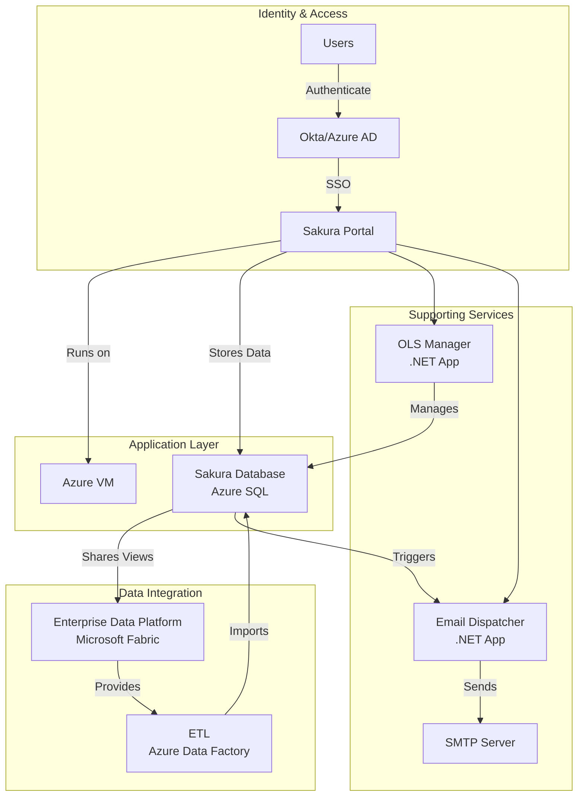
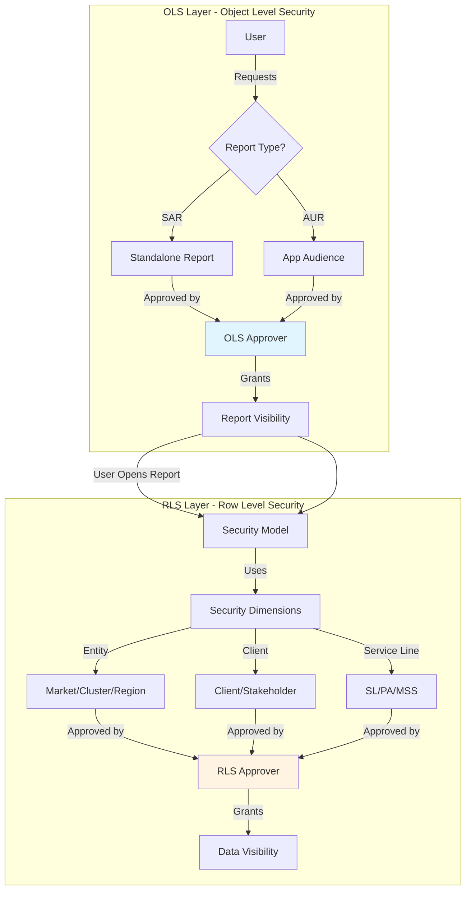
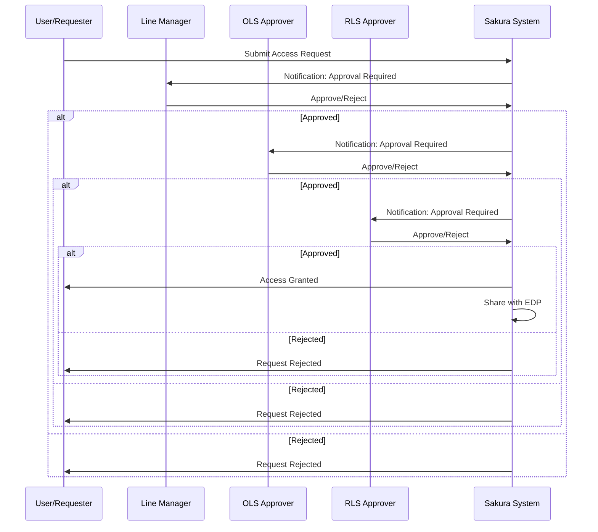
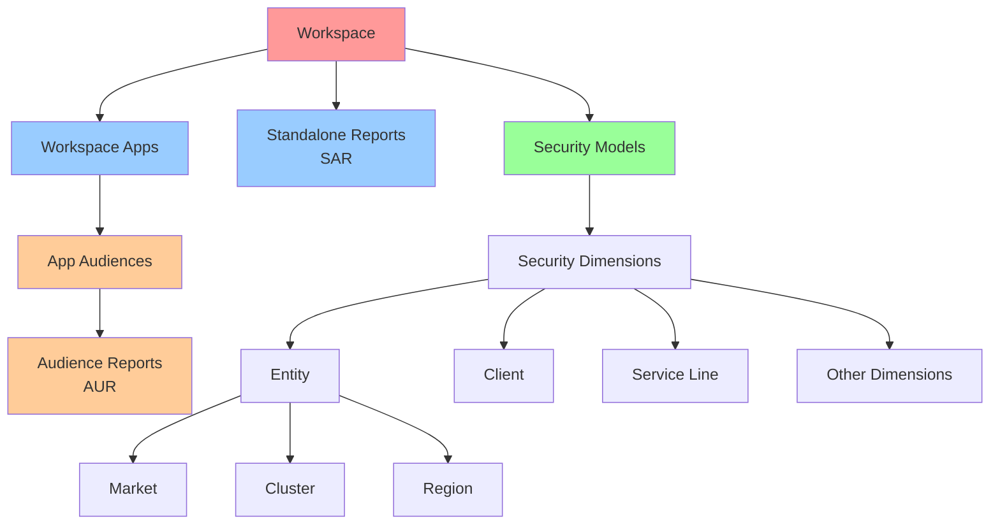

# Overview

## Purpose of This Document

The purpose of this document is to define the functional design of the Sakura application. It outlines the intended behavior of the system from a business and end-user perspective, detailing the roles, workflows, features, and rules that govern how access requests are submitted, approved, and managed.

This document serves as a common reference point for stakeholders, including product owners, developers, testers, and administrators. It captures functional expectations to ensure that the implementation aligns with the defined access control objectives, user experience requirements, and operational boundaries of Sakura.

---

## Scope of the Application

Sakura is a **self-service authorization management portal** designed for users within the dentsu organization to request, approve, and manage access to Power BI reports and datasets. It supports both **Object-Level Security (OLS)** and **Row-Level Security (RLS)** across multiple delivery contexts, including Standalone Reports, Workspace Apps, and App Audiences.

### What Sakura Does

The application covers the full request lifecycle:
- Report/audience selection and access configuration
- Multi-step approval flows involving Line Managers, OLS Approvers, and RLS Approvers
- Role-based administration
- Audit logging
- Delegation capabilities
- In-app help
- Email notification features

### What Sakura Does NOT Do

**Sakura does not manage user access directly within Power BI.** Instead, it:
- Centralizes access request logic and approval workflows
- Shares finalized permission outputs with downstream systems through database views
- Acts as the governance layer for access management

---

## Architecture Diagram

The architecture of Sakura V2 consists of several integrated components within the dentsu Azure and VPN environment. Each component plays a specific role in supporting access request workflows, data integration, and system operations.

*Figure 1 - Architecture Diagram*

### Architecture Component Relationships

### Architecture Components

#### **Sakura Portal**
The user-facing web application where end users submit access requests and approvers review and take action on them.

#### **Okta + Azure AD**
The identity providers used for user authentication and access control. All users must log in using their corporate credentials before accessing the Sakura Portal.

#### **Users**
All authorized dentsu users who can log into Sakura to request access, approve requests, or manage administrative configurations.

#### **Virtual Machine (Azure VM)**
The compute environment where the Sakura application and supporting services run.

#### **Sakura Database (Azure SQL)**
The central database that stores all metadata related to access requests, user roles, approvals, audit logs, and configuration.

#### **ETL (Azure Data Factory)**
Responsible for transferring Security Dimension Data from external systems into the Sakura Database.

#### **Enterprise Data Platform (Microsoft Fabric)**
- **Provides to Sakura:** Security Dimensions such as organizational hierarchies, client lists, and other RLS-relevant structures
- **Receives from Sakura:** Approved RLS Requests, which can be used for further data access control or downstream processing

#### **OLS Manager (Custom .NET Application)**
A utility interface used for managing object-level security mappings such as report-to-audience relationships or manual overrides.

#### **Email Dispatcher (Custom .NET Application)**
Handles email notifications for request submissions, approvals, rejections, and several other user-facing system actions.

---

## Intended Audience and User Roles

Sakura has five distinct user roles, each with specific responsibilities:

| **Role** | **Description** |
|----------|----------------|
| **Requester** | End user requesting access |
| **Approver** | Reviews and approves/rejects access requests |
| **Workspace Admins** | Manages security models, approvers and object definitions within a Workspace |
| **Sakura Support** | Handles questions, technical issues, and helps users resolve blockers |
| **Sakura Administrator** | Configures the system, manages settings, automation, and audit features as well as Workspaces and Security Dimensions |

> **Note:** A single user can have multiple roles. For example, a Workspace Admin can also be a Requester and an Approver.

---

## Key Definitions

Understanding Sakura's core concepts is essential. The system manages two types of security: **Object-Level Security (OLS)** and **Row-Level Security (RLS)**.

### Visual Overview

*Figure 2 - Virtual Equivalents of Objects in Sakura and MS Fabric*

*Figure 3 - Report Delivery Scenarios and Methods*

*Figure 4 - ER Diagram of Sakura Key Elements*

### Object-Level Security (OLS) Components

#### **Workspace**
The foundational unit in Sakura represents a Power BI Workspace. It holds all analytical components such as reports, datasets (semantic models), security models, and Workspace Apps. It is the starting point for both OLS and RLS configurations in Sakura.

**Currently available workspaces in dentsu:**

| Fabric Workspace | Owner(s) | PBI Model | UMS Data Domain | PBI Designer | DWH Designer |
|------------------|----------|-----------|------------------|--------------|--------------|
| DFI Workspace | Kate Rudwick / Terry Newell | FUM | Finance | Vitali/ Yadava | Sumon/ Sean |
| Growth Insights Workspace | Nico Benga | Growth Insights Model | Growth Insights | Vitali/ Yadava | Amit |
| CDI Workspace | Nitin Menon | CDI Model | Not Applicable | Yadava | Sean |
| Workforce Workspace | Safraz Hakamali | Workforce Model | Workforce, Timesheet | Alok | Alok |
| AMER Workspace | Ken Lovingood | ACM | Not Applicable | Pradeep | Dhiraj |
| EMEA Workspace | Patrick Sura | EMEA market-specific models | Not Applicable | Alex (CE) Sara (FR) Simon (NOEUR) | Alex |

#### **Workspace Apps**
A container within a workspace in Sakura, equivalent to a Power BI App in Microsoft Fabric. Each Workspace App groups a collection of reports for a specific business purpose and is the main distribution method for reports to end users.

#### **Workspace App Audiences**
A grouping of reports within a Workspace App. Each audience represents a distinct view configuration within the app, defining which reports are visible to which group of people. Audiences do not define the users themselves but instead define sets of reports that certain people are allowed to see.

#### **Workspace Reports**
Workspace Reports refer to all Power BI reports hosted within a Workspace in Sakura, classified based on how they are delivered to end users. There are two main types:

- **Workspace Standalone Reports (SAR):** These reports are shared directly with users without being included in any Workspace App. They are handled individually within Sakura's object-level security model and represent a direct access scenario.

- **Workspace App Audience Reports (AUR):** These reports are included within a specific Audience of a Workspace App and are delivered to users via that App structure.

### Row-Level Security (RLS) Components

#### **Workspace Security Model**
A structure that defines the RLS (Row-Level Security) logic for a given Workspace. It specifies which dimensions are used for filtering and how they apply to the semantic models within the Workspace. If multiple semantic models share the same RLS setup, a single Workspace Security Model is reused across them to avoid redundant access configurations.

#### **Security Dimensions**
Business dimensions (such as Entity, Service Line, Brand) that are used to slice data in semantic models via RLS. In Sakura, these dimensions form the backbone of the Workspace Security Model and control which rows of data a user can see based on their assigned values.

### Request Types

#### **RLS Requests**
These are access requests initiated by end users based on a given Workspace Security Model and its associated Security Dimensions. Users specify the values they need access to (e.g., specific regions or brands), and the request is evaluated against the RLS logic defined in that model.

#### **OLS Requests**
Access requests related to object-level visibility, such as gaining access to a Standalone Report or to a specific App Audience. These requests trigger approval flows based on the target object's ownership and configuration.

### Approver Types

#### **RLS Approvers**
Designated individuals responsible for reviewing and approving RLS Requests. Their approval authority is typically scoped to specific values within a Security Dimension (e.g., a regional manager approving access to their region's data).

#### **OLS Approvers**
Users responsible for approving OLS Requests. Their responsibility depends on the context, for example, a report owner for Standalone Reports or an audience-level approver for reports accessed via App Audiences. The OLS approver logic in Sakura supports both report-based and audience-based ownership models.

### Other Key Terms

#### **Report Catalogue**
The Report Catalogue is the unified registry of all reports, audiences, and apps across every Workspace within Sakura. It acts as a central access point where users can view what content exists, regardless of their permission status. Each item's type (report, audience, app) is visually distinguished, allowing for intuitive understanding. The catalogue includes a search function to help users quickly locate content. Additionally, each item is visually marked to indicate whether the user has access, enabling a clear and immediate understanding of visibility rights.

---

## Mental Model: How It All Fits Together

### The Big Picture

1. **User wants access** → Opens Sakura Portal
2. **User searches for report** → Uses Report Catalogue
3. **User selects report** → System determines if it's SAR or AUR
4. **User defines access needs** → Selects OLS (which report/audience) and RLS (which data)
5. **Request submitted** → Goes through approval chain: Line Manager → OLS Approver → RLS Approver
6. **Request approved** → Access granted, data shared with downstream systems

### The Two-Layer Security Model

Think of Sakura's security as two layers:

1. **OLS Layer (What you can see):** 
   - "Can I see this report?"
   - "Can I see this app audience?"
   - Controlled by OLS Approvers

2. **RLS Layer (What data you see):**
   - "When I open the report, which rows of data can I see?"
   - "Can I see data for Germany? For Client X?"
   - Controlled by RLS Approvers and Security Dimensions

### The Approval Chain

Every request must pass through three gates:
1. **Line Manager** - "Does this employee need this access for their job?"
2. **OLS Approver** - "Should this user see this report/audience?"
3. **RLS Approver** - "Should this user see this specific data?"

All three must approve for access to be granted.

### Workspace Hierarchy

---

## Next Steps

Now that you understand the overview:
- **If you're a Requester:** Read [Requester Role](03-requester-role.md)
- **If you're an Approver:** Read [Approver Role](04-approver-role.md)
- **If you're a Workspace Admin:** Read [Workspace Requirements](02-workspace-requirements.md) and [Workspace Admin Role](05-workspace-admin-role.md)
- **To understand workspace-specific configurations:** Read [Workspace Requirements](02-workspace-requirements.md)

---

*[← Back to README](README.md) | [Next: Workspace Requirements →](02-workspace-requirements.md)*
