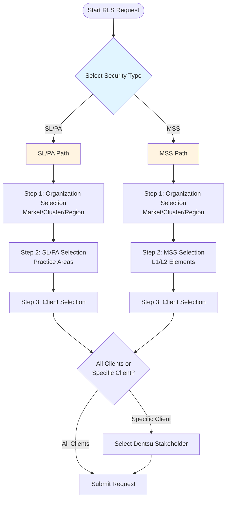
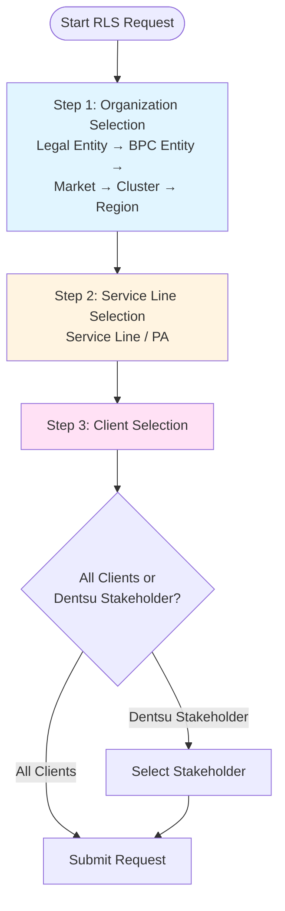
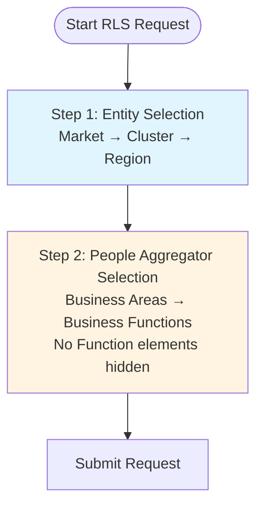
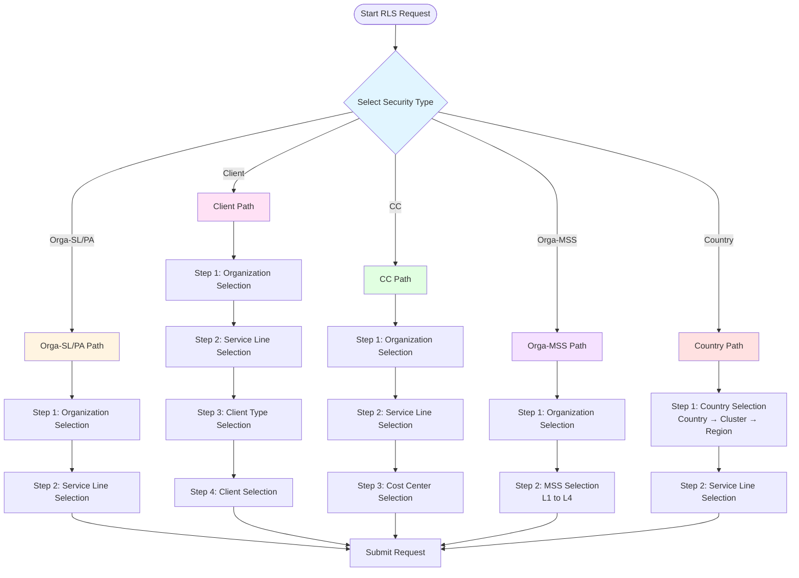
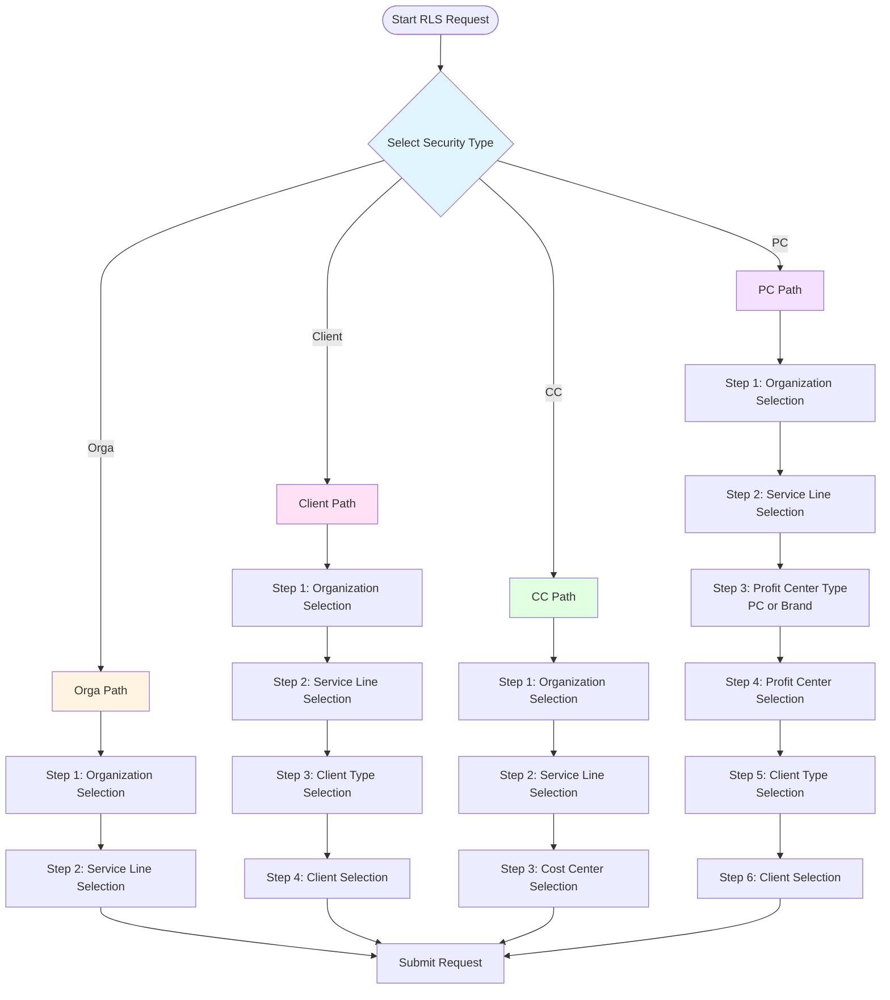
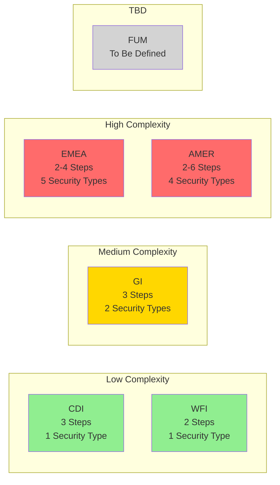

# Workspace-Specific RLS Requirements

## Introduction

Each Workspace in Sakura has unique data structures, governance rules, and access patterns, which require tailored RLS configurations and Wizard UI logic. This section consolidates the finalized requirements for each workspace into two subsections:

- **Security Dimensions**: Specifies which business attributes (e.g., Market, Client, Practice Area) should be used to define access control per Workspace and confirm their availability in the UMS data model.

- **RLS Dimension Selection Workflow**: Describes how access requests should be guided, and the information is collected during the request creation.

> **Note:** The requirements in this section are based on the original *Sakura Security Access -- Requirements Document*. However, after its finalization, additional alignment meetings were conducted with individual Workspace Owners to further clarify and revise the expectations around Security Dimensions and RLS Workflows.

---

## Requirements of FUM (Finance Unified Model)

> **Status:** To Be Written (TBW)

### Security Dimensions
*To be defined*

### RLS Dimension Selection Workflow
*To be defined*

---

## Requirements of GI (Growth Insights)

**Meeting:** "Sakura RLS for GI"  
**Date:** 21.07.2025 at 15:30 CET

### Security Dimensions

| Dimension | Dimension Attributes | SL/PA Based | MSS Based |
|-----------|----------------------|-------------|-----------|
| BL_UMV.DimEntity | Market → Cluster → Region | x | x |
| BL_UMV.DimClient | Client → Dentsu Stakeholder | x | x |
| BL_UMV.DimServiceLine | Service Line (filtered to PAs) | x | |
| BL_UMV.DimMasterServiceSet | L2 → L1 + Overall | | x |

**Security Types:** SL/PA, MSS

### RLS Dimension Selection Workflow

*Figure 5 - RLS Workflow for GI Workspace*

The RLS request workflow for the Growth Insights Workspace begins with the selection of a Security Type. At this stage, users are presented with two options:

- **SL/PA** (Service Line / Practice Area)
- **MSS** (Master Service Set)

Depending on the selected Security Type, the workflow follows one of two predefined paths. Both paths consist of three steps, differing only in the second step.

### GI Workflow Diagram

#### SL/PA Path

1. **Step 1: Organization Selection**
   - The user is asked to choose an organization level: Market, Cluster, or Region
   - Based on the selection, the corresponding list is displayed
   - Example: If the user selects "Cluster", a list of available clusters is shown for selection

2. **Step 2: SL/PA Selection**
   - The user is presented with a tree-structured list showing only Practice Areas
   - After selecting a Practice, the flow continues

3. **Step 3: Client Selection**
   - The user chooses between All Clients and Specific Client
   - If "All Clients" is selected, the process proceeds to the next step
   - If "Specific Client" is selected, a list of Dentsu Stakeholders is shown, from which the user selects one stakeholder before continuing

#### MSS Path

1. **Step 1: Organization Selection**
   - Identical to the SL/PA path, the user selects one of: Market, Cluster, or Region
   - The corresponding list is shown

2. **Step 2: MSS Selection**
   - The user is shown a hierarchical list of MSS L1 and L2 elements
   - After selecting the appropriate MSS node, the flow continues

3. **Step 3: Client Selection**
   - Same logic as in the SL/PA path: the user selects either All Clients or a Specific Client
   - If applicable, the Dentsu Stakeholder list is triggered

---

## Requirements of CDI (Client Data Insights)

**Meeting:** "Sakura V2 RLS Dimensions for GI Workspace"  
**Date:** 05.08.2025 at 10:00 CET

### Security Dimensions

| Dimension | Dimension Attributes | CDI |
|-----------|----------------------|-----|
| BL_UMV.DimEntity | Legal Entity → BPC Entity → Market → Cluster → Region | x |
| BL_UMV.DimClient | Client → Dentsu Stakeholder | x |
| BL_UMV.DimServiceLine | Service Line / PA | x |

**Security Types:** CDI (no Security Type selection is asked)

### RLS Dimension Selection Workflow

*Figure 6 - RLS Workflow for CDI Workspace*

The RLS workflow for the CDI Workspace is simplified, as it involves only one Security Type. Therefore, there is no initial Security Type selection. Instead, the user is guided through a fixed three-step process to define access across two hierarchical dimensions:

### CDI Workflow Diagram

1. **Step 1: Organization Selection**
   - The user selects a level from Entity, such as Market, Cluster, or Region
   - Based on the selection, the relevant list is shown
   - Example: Selecting "Cluster" displays the available clusters

2. **Step 2: Service Line Selection**
   - The user selects a Service Line or Practice Area from the tree structure

3. **Step 3: Client Selection**
   - The user chooses between All Clients and Dentsu Stakeholders
   - If All Clients is selected, the process continues directly
   - If Dentsu Stakeholder is selected, a list of stakeholders is shown, from which the user selects one

---

## Requirements of WFI (Workforce Insights)

**Meeting:** "Sakura 2.0 - Workforce Model"  
**Date:** 23.07.2025 at 15:00 CET

### Security Dimensions

| Dimension | Dimension Attributes | WFI |
|-----------|----------------------|-----|
| [sensitive].[DimPeopleAggregatorNodeWD] | Business Areas > Business Functions | x |
| BL_UMV.DimEntity | Market → Cluster → Region | x |

**Security Types:** WFI (no Security Type selection is asked)

### RLS Dimension Selection Workflow

*Figure 7 - RLS Workflow for WFI Workspace*

The RLS workflow for the Workforce Insights (WFI) Workspace is simplified, as it involves only one Security Type. Therefore, there is no initial Security Type selection. Instead, the user is guided through a fixed two-step process to define access across two hierarchical dimensions:

### WFI Workflow Diagram

1. **Step 1: Entity Selection**
   - The user is asked to choose an organization level: Market, Cluster, or Region
   - Based on the selection, the corresponding list is displayed
   - Example: If the user selects "Cluster", a list of available clusters is shown for selection

2. **Step 2: People Aggregator Selection**
   - The user is then asked to choose a People Aggregator value from a hierarchical structure which has **Business Area** and underneath **Business Functions**
   - The "No Function" elements are hidden from the tree
   - The tree structure should look like this:

*Figure 8 - WFI Wizard People Aggregator Tree View*

---

## Requirements of EMEA (Europe, Middle East and Africa)

**Meeting:** Weekly regular meeting  
**Date:** 25.07.2025 at 10:00 CET

The RLS configuration for the EMEA Workspace follows a multi-path structure, where the user begins by selecting one of five Security Types. Each Security Type corresponds to a distinct sequence of dimension selections.

### Security Dimensions

| Dimension | Dimension Attributes | Orga | Client | CC | Country | MSS |
|-----------|----------------------|------|--------|----|---------|-----|
| BL_UMV.DimEntity | Legal Entity → BPC Entity → Market → Cluster → Region → Global | x | x | x | | x |
| BL_UMV.DimServiceLine | Service Line → Overall | x | x | x | x | |
| BL_UMV.DimClient | Client → Dentsu Stakeholder → All | | x | | | |
| BL_UMV.DimCostCenter | | | | x | | |
| BL_UMV.DimCountry | Country → Cluster → Region → Global | | | | x | |
| BL_UMV.DimMasterServiceSet | L4 → L3 → L2 → L1 - Overall | | | | | x |

**Security Types:** Orga - SL/PA, Client, CC, Country, Orga - MSS

### RLS Dimension Selection Workflow

*Figure 9 - RLS Workflow for EMEA Workspace*

The RLS request workflow for EMEA Workspace begins with the selection of a Security Type. At this stage, users are presented with five options:

- **Orga - SL/PA** (Service Line / Practice Area)
- **Client**
- **CC** (Cost Center)
- **Orga - MSS**
- **Country**

### EMEA Workflow Diagram

#### Orga - SL/PA Path

1. **Step 1: Organization Selection**
   - The user selects a level from Entity, such as Market, Cluster, or Region
   - Based on the selection, the relevant list is shown
   - Example: Selecting "Cluster" displays the available clusters

2. **Step 2: Service Line Selection**
   - The user selects a Service Line or "Overall" from Service Line tree

#### Client Path

1. **Step 1: Organization Selection**
   - The user selects a level from Entity, such as Market, Cluster, or Region
   - Based on the selection, the relevant list is shown

2. **Step 2: Service Line Selection**
   - The user selects a Service Line or "Overall" from Service Line tree

3. **Step 3: Client Type Selection**
   - The user chooses between All Clients and Dentsu Stakeholders
   - If **All Clients** is selected, the process proceeds to the next step
   - If **Dentsu Stakeholder** is selected, the user is shown a list of stakeholders to choose from

4. **Step 4: Client Selection**
   - The user selects a stakeholder from the list (if applicable)

#### CC (Cost Centre) Path

1. **Step 1: Organization Selection**
   - The user selects a level from Entity, such as Market, Cluster, or Region
   - Based on the selection, the relevant list is shown

2. **Step 2: Service Line Selection**
   - The user selects a Service Line or "Overall" from Service Line tree

3. **Step 3: Cost Center Selection**
   - The user selects a Cost Center from the tree
   - The content of the tree changes based on the previous selection of Organization
   - For Levels upper than Legal Entity in Organization selection, only BPC Rollups will be shown
   - Single Cost Center and Business Unit elements are only available on Legal Entity level because they are legal entity specific

#### MSS Path

1. **Step 1: Organization Selection**
   - The user selects a level from Entity, such as Market, Cluster, or Region
   - Based on the selection, the relevant list is shown

2. **Step 2: MSS Selection**
   - The user navigates the hierarchy in MSS (L1 to L4) and selects an MSS value

#### Country Path

1. **Step 1: Country Selection**
   - The user selects a level from Geo Hierarchy, such as Country, Cluster, or Region

2. **Step 2: Service Line Selection**
   - The user selects a Service Line or "Overall" from Service Line tree

---

## Requirements of AMER (Americas)

**Meeting:** "Sakura 2.0 - AMER implementation"  
**Date:** 28.07.2025 at 14:00 CET

### Security Dimensions

| Dimension | Dimension Attributes | Orga | Client | CC | PC |
|-----------|----------------------|------|--------|-----|-----|
| BL_UMV.DimEntity | Legal Entity → BPC Entity → Market → Cluster → Region → Global | x | x | x | x |
| BL_UMV.DimServiceLine | Service Line → Overall | x | x | x | x |
| BL_UMV.DimClient | | | x | | x |
| BL_UMV.DimProfitCenter | Profit Center → Brand - All | | | | x |
| BL_UMV.DimCostCenter | | | | x | |

**Security Types:** Orga, Client, CC, PC

### RLS Dimension Selection Workflow

*Figure 10 - RLS Workflow for AMER Workspace*

The RLS request workflow for the AMER Workspace begins with the selection of a Security Type. At this stage, users are presented with four options:

- **Orga**
- **Client**
- **CC** (Cost Center)
- **PC** (Profit Center)

### AMER Workflow Diagram

#### Orga - SL/PA Path

1. **Step 1: Organization Selection**
   - The user selects a level from Entity, such as Market, Cluster, or Region
   - Based on the selection, the relevant list is shown
   - Example: Selecting "Cluster" displays the available clusters

2. **Step 2: Service Line Selection**
   - The user selects a Service Line or "Overall" from Service Line tree

#### Client Path

1. **Step 1: Organization Selection**
   - The user selects a level from Entity, such as Market, Cluster, or Region

2. **Step 2: Service Line Selection**
   - The user selects a Service Line or "Overall" from Service Line tree

3. **Step 3: Client Type Selection**
   - The user chooses between All Clients and Dentsu Stakeholders
   - If All Clients is selected, the process proceeds to the next step
   - If Dentsu Stakeholder is selected, the user is shown a list of stakeholders to choose from

4. **Step 4: Client Selection**
   - The user selects a stakeholder from the list (if applicable)

#### CC (Cost Center) Path

1. **Step 1: Organization Selection**
   - The user selects a level from Entity, such as Market, Cluster, or Region

2. **Step 2: Service Line Selection**
   - The user selects a Service Line or "Overall" from Service Line tree

3. **Step 3: Cost Center Selection**
   - The user selects a Cost Center from the tree
   - The content of the tree changes based on the previous selection of Organization
   - For levels above Legal Entity, only BPC Rollups are shown
   - Single Cost Center and Business Unit elements are only available on Legal Entity level because they are legal entity specific

#### PC (Profit Center) Path

1. **Step 1: Organization Selection**
   - The user selects a level from Entity, such as Market, Cluster, or Region

2. **Step 2: Service Line Selection**
   - The user selects a Service Line or "Overall" from Service Line tree

3. **Step 3: Profit Center Type Selection**
   - The user chooses between Profit Center or Brand

4. **Step 4: Profit Center Selection**
   - Based on the previous selection, a list of PCs or Brands is shown for selection

5. **Step 5: Client Type Selection**
   - The user chooses between All Clients and Dentsu Stakeholders

6. **Step 6: Client Selection**
   - If Dentsu Stakeholder is selected, the user selects a stakeholder from the list

---

## Summary: Workspace Comparison

| Workspace | Security Types | Key Dimensions | Complexity |
|-----------|----------------|----------------|------------|
| **FUM** | TBD | TBD | TBD |
| **GI** | SL/PA, MSS | Entity, Client, Service Line, MSS | Medium |
| **CDI** | CDI (single) | Entity, Client, Service Line | Low |
| **WFI** | WFI (single) | Entity, People Aggregator | Low |
| **EMEA** | Orga-SL/PA, Client, CC, Country, Orga-MSS | Entity, Service Line, Client, Cost Center, Country, MSS | High |
| **AMER** | Orga, Client, CC, PC | Entity, Service Line, Client, Cost Center, Profit Center | High |

### Workspace Complexity Comparison

---

## Mental Model: Understanding Workspace Requirements

### Why Different Workspaces Have Different Requirements

Each workspace serves different business needs:
- **GI (Growth Insights):** Focuses on service lines and master service sets
- **CDI (Client Data Insights):** Simplified structure for client-focused analytics
- **WFI (Workforce Insights):** People-centric with business areas and functions
- **EMEA:** Complex multi-path structure supporting various regional needs
- **AMER:** Similar to EMEA but with Profit Center focus

### The Security Type Concept

Security Types are like "modes" or "paths" through the access request wizard:
- Some workspaces have **one path** (CDI, WFI) - simpler, faster
- Some have **multiple paths** (GI, EMEA, AMER) - more flexible, more complex

Think of it like choosing a route on a map - different routes get you to different destinations (data access).

### The Dimension Hierarchy

Most dimensions are hierarchical:
- **Entity:** Global → Region → Cluster → Market → Legal Entity
- **Service Line:** Overall → Service Line → Practice Area
- **Client:** All Clients → Dentsu Stakeholder → Specific Client

When you select a higher level (e.g., "Region"), you typically get access to all lower levels within it.

---

*[← Back to Overview](01-overview.md) | [Next: Requester Role →](03-requester-role.md)*
