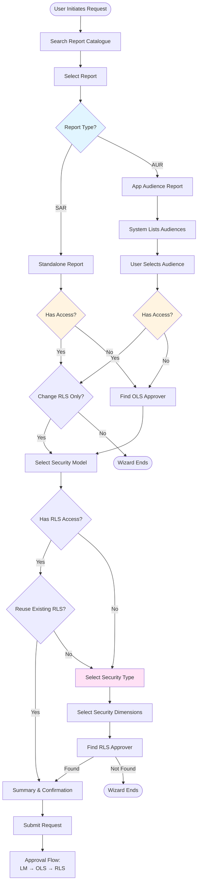
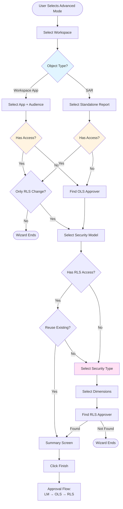
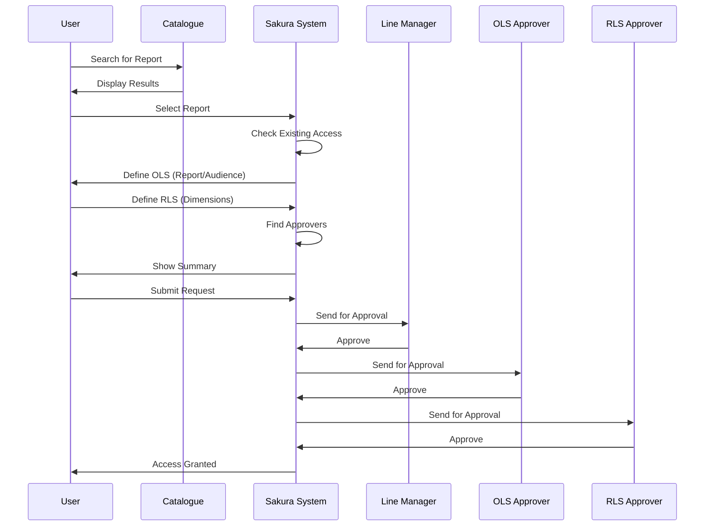
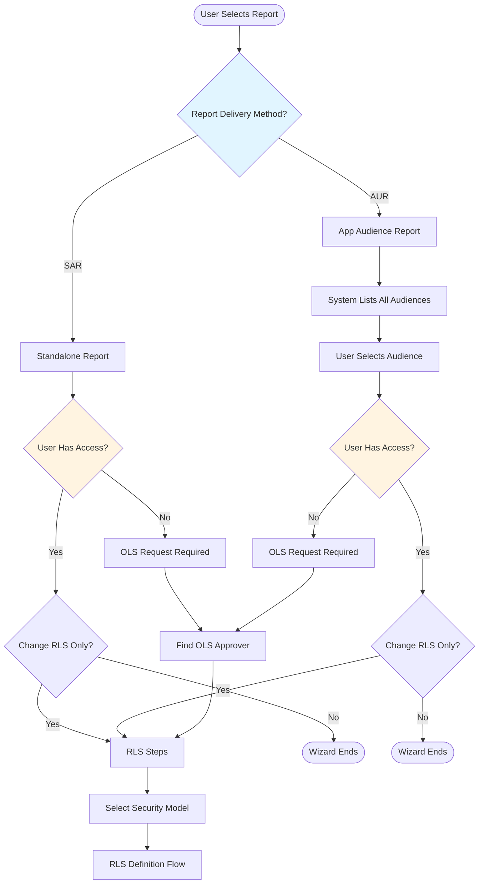

# Requester Role

## Overview

The **Requester** role is for end users who need to request access to Power BI reports and datasets. This is the most common role in Sakura, as most users will primarily interact with the system as requesters.

As a Requester, you can:
- Request access for yourself
- Request access on behalf of another user
- View your existing access rights
- View your request history
- Receive email notifications about your requests

---

## Requesting Access

Sakura offers a structured and intelligent wizard-based interface for end users to request access to Power BI reports and datasets, supporting both Object-Level Security (OLS) and Row-Level Security (RLS). The request process is dynamic and adapts based on the report's delivery method, existing access, and workspace configuration.

There are **two ways** to request access:

1. **Using Report Catalogue** (Guided Mode) - Recommended for most users
2. **Advanced Mode** - For experienced users who know the exact workspace/app structure

---

## Method 1: Requesting Access Using Report Catalogue

This is the **recommended method** for most users. It guides you step-by-step through the access request process, starting from report discovery.

### Visual Workflow

*Figure 11 - Access Request Wizard Using Report Catalogue*

### Report Catalogue Request Flow

### Step-by-Step Process

#### Step 1: User Initiates the Request

- The user begins by searching for a report they need access to using the built-in search functionality from the Report Catalogue
- The results will show clearly the type of report (SAR/AUR) and which App that report belongs to
- If there are multiple reports with the same name, they will be listed as separate items

#### Step 2: Report Selection

- The user selects the desired report from the search results

#### Step 3: System Determines Report Delivery Method

- Sakura checks how the selected report is delivered:
  - **Standalone Report** (SAR)
  - **Audience Report** (AUR) - distributed via a Workspace App

#### Step 4: Branch 1 - Standalone Report

- The system checks if the user already has access
  - **If access exists:** The user is prompted whether they only want to change the RLS
    - If "Yes", the process continues with RLS steps
    - If "No", the wizard ends
  - **If access does not exist:** Sakura identifies the OLS approver and proceeds

#### Step 5: Branch 2 - App Audience Report

- The system finds all audiences associated with the report and lists them
  - If **multiple audiences** are available, the user selects one
- The system checks if the user already has access to the selected audience
  - **If access exists:** The user is asked if they only want to change the RLS
    - If "No", the wizard ends
  - **If access does not exist:** The system proceeds with OLS steps
- Sakura finds the applicable OLS Approver and stores the OLS permission in memory

#### Step 6: Security Model Selection

- The system lists all Security Models for the selected Workspace
  - If only one model is found, Sakura auto-selects it
  - If multiple models exist, the user chooses the desired one

#### Step 7: Check Existing RLS Access

- Sakura checks if the user already has RLS access to the selected Security Model
  - **If access exists:** The user is asked if they would like to reuse existing RLS
    - If "Yes", the wizard skips to summary
    - If "No", proceed with custom RLS definition

#### Step 8: Security Type Selection

- The system lists available Security Types for the selected model
- The user selects a Security Type
- *Note: Security Types vary by workspace. See [Workspace Requirements](02-workspace-requirements.md) for details*

#### Step 9: Security Dimension Selection

- Based on the selected Security Type, Sakura displays relevant Security Dimensions
- The user selects values from each dimension as needed
- *The workflow varies by workspace. See [Workspace Requirements](02-workspace-requirements.md) for workspace-specific workflows*

#### Step 10: Approver Detection

- Sakura attempts to find an RLS Approver matching the selected combination of dimension values
  - **If no approver is found:** The wizard ends (user cannot proceed)
  - **If found:** The request proceeds

#### Step 11: Summary & Confirmation

- Sakura displays a summary view showing:
  - OLS and RLS request details
  - Any previously granted access
- The user reviews the summary and clicks **Finish** to submit the request

#### Step 12: Request Finalization

- The system creates the RLS and/or OLS permissions as needed and stores the request in the system
- Approval flow is triggered accordingly: **Line Manager → OLS Approver → RLS Approver**
- The requester receives a confirmation email

---

## Method 2: Requesting Access in Advanced Mode

Sakura's Advanced Mode offers a more direct way for experienced users to submit access requests when they already know the technical structure of the Workspace, App, Audience, or Report they need access to. Unlike the Report Catalogue mode, this path allows users to bypass catalogue-driven discovery and instead select the OLS and RLS request contexts directly.

### Visual Workflow

*Figure 12 - Access Request Wizard Advanced Mode*

### Advanced Mode Request Flow

### Step-by-Step Process

#### Step 1: User Initiates Advanced Request

- From the **Requests** menu, user selects **New Request (Advanced)**

#### Step 2: Workspace Selection

- The system displays a list of available Workspaces
- User selects the Workspace they want to access

#### Step 3: Object Selection

- User is asked to define the scope of access:
  - **Workspace App** + Audience
  - or a **Standalone Report (SAR)**

#### Step 4: Delivery Method Logic

- Based on the selection:
  - If the selected item is a **SAR**, the system checks for existing access to that report
  - If it is an **Audience**, system checks if the user already has access to that Audience

#### Step 5: Access Evaluation

- If access already exists, users are asked whether they want to request **only RLS** changes
  - If user selects "No," the wizard ends
  - If "Yes" or access does not exist, process continues

#### Step 6: OLS Approver Detection

- System finds the relevant OLS Approver
- OLS permission is stored in memory and process moves to RLS steps

#### Step 7: Security Model Selection

- The system lists all Workspace Security Models related to the selected object
- If only one exists, it is selected automatically
- If multiple, users choose one

#### Step 8: Check for Existing RLS Access

- The system checks if the user already has access to the selected model
- If yes, the user is asked if they want to use the existing RLS record
  - If yes, wizard proceeds to summary

#### Step 9: Security Type and Dimension Selection

- User selects the **Security Type**
- System loads the related **Security Dimensions**
- User chooses the required dimension values

#### Step 10: Approver Lookup

- Sakura tries to find the RLS Approver for the selected combination
  - If no approver is found, the wizard ends
  - If found, wizard proceeds

#### Step 11: Summary and Finalization

- The system shows a summary screen with OLS and RLS request information
- User clicks **Finish**

#### Step 12: Submission and Approvals

- The system creates OLS and RLS permission requests
- Standard approval flow begins: **Line Manager → OLS Approver → RLS Approver**

---

## Other Request Wizard Functionalities

### Can Submit Multiple Access Requests

Sakura does not restrict users from submitting multiple access requests for the same workspace. A user can submit:

- Multiple OLS requests (e.g., for different reports or audiences)
- Multiple RLS requests (e.g., for different security dimension combinations)
- Or any combination of both

**Important:** Each OLS or RLS request is treated as a separate and independent access request. Accordingly, each one triggers its own approval workflow.

During approval, approvers will be able to see the requester's existing access rights within the same workspace.

### "Help Me" Option for Unsure Requesters

At any step in the request wizard, users who are unsure how to proceed can click the **"Help me"** button located on the page.

Depending on the context of the step:

- **If the step already involves a known Workspace:** The help request is automatically forwarded to the corresponding Workspace Owner. They are responsible for reviewing the help request and guiding the user accordingly.

- **If the wizard step occurs before a Workspace has been determined** (e.g., report search, before selection): The system forwards the help request to GoTo, prompting the user to create a Sakura App Support Case for further assistance.

This feature ensures that users do not get stuck or abandon their request due to uncertainty, while routing the request to the right responsible party based on where they are in the flow.

### Request on Behalf of Another User

During one of the steps in the request wizard, the user is asked whether the access request is being created for themselves or on behalf of someone else.

- **If the request is being created for another person:**
  - The user submitting the request is recorded as **Requested By**
  - The person the request is intended for is recorded as **Requested For**

- **If the request is for the user's own access:**
  - Both values (Requested by and Requested For) are set to the same user

This functionality is particularly useful in onboarding scenarios where a buddy or line manager (LM) initiates access requests for a new joiner.

> **Note:** Unlike Sakura V1, in V2 it is no longer possible to submit access requests on behalf of multiple users at once. Requests must be created individually per single user. See [Out of Scope](09-out-of-scope.md) for more information.

### Wizard Workflow Entry Points

Sakura provides multiple entry points for users to initiate access requests, depending on their level of certainty and familiarity with the report structure.

There are two primary modes for creating requests, accessible via the Requests menu:

- **New Request (Using Report Catalogue):** This is the Guided mode. It walks the user step by step through the access request process, starting from report selection and proceeding through delivery method, OLS, and RLS definitions.

- **New Request (Advanced):** This mode allows more experienced users to directly select the target Workspace App, or Report and manually define OLS and RLS details.

Additionally, external report catalogues or documentation systems (such as SharePoint, Confluence, or GoTo) can redirect users directly into Sakura's Guided mode, with a specific report preselected. This is done by appending parameters (e.g., `reportTag`) to the URL, which Sakura can use to pre-load the wizard with the correct context.

There are no restrictions on how a request should be initiated. Whether launched from within Sakura or from an external tool, users are free to start wherever is most convenient, as long as the necessary identifiers (e.g., `reportTag`) are provided in the URL.

---

## Viewing Existing Access

Sakura provides two distinct views for users to monitor their current access rights and the history of their access requests.

### My Access

- Users can navigate to the **My Access** section from the main menu to view a list of all access rights currently granted to them
- This includes both Object-Level Security (OLS) and Row-Level Security (RLS) permissions
- Shows active permissions only

### My Requests

- The **My Requests** section displays access request history where:
  - The user submitted the request for themselves, or
  - The user submitted the request on behalf of someone else, or
  - A request was submitted by someone else on behalf of the user

- Records are categorized as OLS and RLS, and displayed separately
- Shows all requests regardless of status (pending, approved, rejected, revoked)

### Request Details View

- Clicking on any record opens a read-only detail page with:
  - Full request metadata
  - Approval status and audit history
  - Current step in the approval chain

- No actions can be performed on this page. However, contextual links are provided to navigate related items, such as:
  - The relevant Workspace App
  - The associated Audience or Standalone Report (SAR)
  - Linked Security Models for RLS records
  - Related approvers

---

## Notifications & Emails

Sakura keeps requesters informed throughout the lifecycle of their access requests via automated email notifications and in-app alerts.

### Email Notifications to Requesters

#### Submission Confirmation

- Immediately after submitting a request, the requester receives a confirmation email including:
  - Request summary
  - Date of submission
  - A Reference for the Request

#### Approval Notifications

- The requester is notified when each approval step is completed (Line Manager, OLS, and RLS)
- Emails indicate which step has been approved and who approved it

#### Rejection Notifications

- If the request is rejected at any step, the requester receives an email with:
  - Rejection reason (mandatory field from approver)
  - Step at which it was rejected
  - Guidance to resubmit if applicable

#### Revocation Notifications

- If the request is revoked at any step, the requester receives an email with:
  - Revocation reason (mandatory field from approver)
  - Guidance to resubmit if applicable

#### Delegation Awareness

- If an approver is unavailable and the request is approved by a delegate, the requester is still informed of who approved on their behalf

---

## Mental Model: The Requester Journey

### The Complete Flow

### Decision Tree: SAR vs AUR

### Key Decision Points

1. **Which method?** Report Catalogue (easier) vs Advanced (faster if you know the structure)
2. **Which report?** SAR (direct) vs AUR (via app audience)
3. **Which security type?** Varies by workspace
4. **Which dimensions?** Based on your data access needs
5. **For whom?** Yourself or someone else

### Common Scenarios

**Scenario 1: First-time access to a report**
- Use Report Catalogue
- Select report
- Define both OLS and RLS
- Submit and wait for approvals

**Scenario 2: Need different data access to existing report**
- Use Report Catalogue or Advanced
- Select same report
- System detects existing OLS access
- Only define new RLS
- Submit and wait for approvals

**Scenario 3: Requesting for a new team member**
- Use either method
- When prompted, select "On behalf of another user"
- Enter team member's email
- Complete rest of wizard
- Submit (you'll receive notifications too)

---

## Tips for Requesters

1. **Start with Report Catalogue** - It's designed to guide you through the process
2. **Use "Help Me"** - Don't hesitate to ask for help at any step
3. **Check existing access first** - Use "My Access" to see what you already have
4. **Be specific with dimensions** - Select the exact data access you need
5. **Monitor your requests** - Check "My Requests" regularly for status updates
6. **Read email notifications** - They contain important information about your requests

---

*[← Back to Overview](01-overview.md) | [Next: Approver Role →](04-approver-role.md)*
