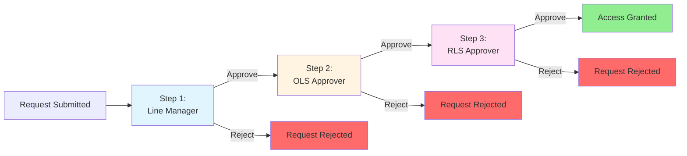
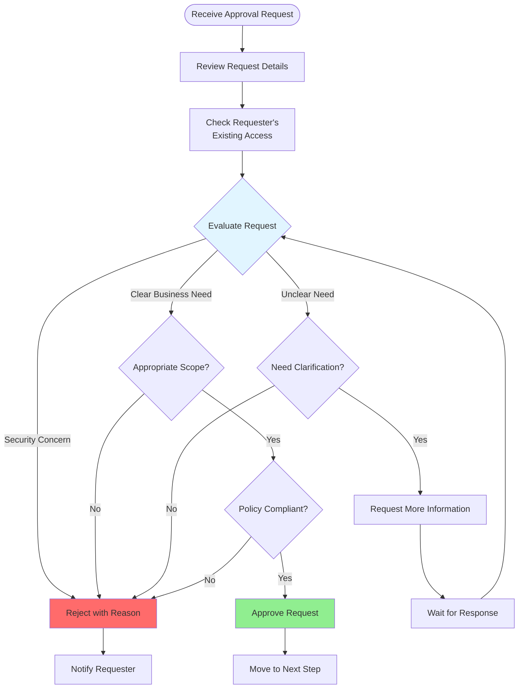
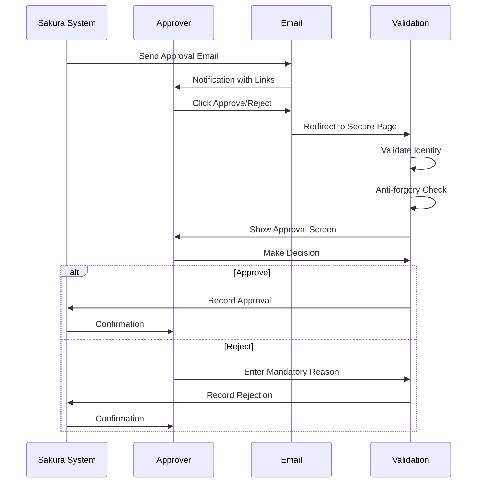

# Approver Role

## Overview

Sakura automatically identifies approvers based on their presence in defined approval intersections. Anyone assigned as an approver for any RLS or OLS context is considered an active **Approver** within the system.

As an Approver, you are responsible for reviewing and making decisions on access requests. Your approval is a critical step in ensuring that users receive appropriate access to Power BI reports and data.

---

## Types of Approvers

There are three types of approval responsibilities within Sakura:

### 1. Line Managers

- **Source:** Retrieved dynamically from Workday
- **Responsibility:** Represent the manager of the employee for whom the request was submitted
- **Decision Focus:** "Does this employee need this access for their job?"
- **When they approve:** First step in the approval chain

### 2. OLS Approvers (Object-Level Security)

- **Source:** Defined at the Workspace level for each report, audience, or app, depending on the report's delivery structure
- **Maintained by:** Workspace Owner, Workspace Technical Owner, or Workspace Approvals Owner
- **Decision Focus:** "Should this user see this report/audience?"
- **When they approve:** Second step in the approval chain (after Line Manager)

#### Rules for Defining OLS Approvers:

- **For Standalone Reports** (when Delivery Mode is not *App-WithAudience*): approvers are defined in the Workspace Reports section

- **If the report is part of an App:**
  - If the Approval Mode in Workspace Apps is *AppBased*, the approver is defined directly in the Workspace Apps
  - If Approval Mode is *AudienceBased*, the approver is defined in App Audiences

### 3. RLS Approvers (Row-Level Security)

- **Source:** Defined per Security Model and based on Security Dimensions
- **Maintained by:** Workspace Owner, Workspace Technical Owner, or Workspace Approvals Owner
- **Decision Focus:** "Should this user see this specific data?"
- **When they approve:** Third step in the approval chain (after Line Manager and OLS Approver)

---

## Approval Flow

When a new access request is submitted, the system follows this sequence:

### Visual Overview

*Figure 13 - Approval Process*

### Three-Step Approval Sequence

### Step-by-Step Approval Sequence

#### Step 1: Line Manager Approval

1. An email notification is sent to the requester's line manager
2. The line manager must approve before the request proceeds
3. If rejected, the request stops and the requester is notified

#### Step 2: OLS Approver Approval

1. After line manager approval, the OLS Approver receives a notification
2. The OLS Approver must approve before the request proceeds
3. If rejected, the request stops and the requester is notified

#### Step 3: RLS Approver Approval

1. Once OLS approval is completed, the RLS Approver is notified
2. The RLS Approver must approve before the request is finally saved as Approved
3. If rejected, the request stops and the requester is notified

### Important Rules

- **Sequential Approval:** Each step must be approved in sequence. You cannot skip steps.
- **Email Notifications:** At every stage, approvers receive email notifications with direct links to the approval task
- **Security Validation:** Sakura performs security and anti-forgery validations before rendering the approval interface
- **No Reopening:** Rejected requests **cannot be reopened or approved** later. A new request must be created.

### What Approvers See During Approval

During approval, approvers will be able to see:

- **Current step and details** in a progress timeline of approval sequence
- **Requester's existing OLS and RLS access rights** within the same workspace
- **Full request details** including OLS and RLS selections
- **Request metadata** such as who requested, when, and for whom

---

## My Approvals Page

The My Approvals section is available to all users in Sakura. However, only those who are assigned as an approver for active or historical requests will see entries listed on this page.

### Sections

The page includes three sections:

- **LM Approvals** - Line Manager approvals
- **OLS Approvals** - Object-Level Security approvals
- **RLS Approvals** - Row-Level Security approvals

### Features

Each section provides:

- **Filters** to switch between **Approved** and **Awaiting Approval** requests
- **View-only access** to historical approvals assigned to them during their active assignment period (past assignments are not visible)
- **Delegated approvals** (when active) will also appear here; for more information, see [Delegations](08-common-functionality.md#delegations)

### Actions Available

- **Approve** button to approve selected requests that are awaiting approval
- **Reject** button with a **mandatory justification message** input to reject selected requests that are awaiting approval
- **Revoke** button with a mandatory justification message input to revoke selected requests that are awaiting approval (only for OLS and RLS Approvers)

---

## Approval Detail Page for an Individual Request

When accessing an approval page for an individual request in Sakura UI, the approval page includes:

### Information Displayed

- **Approval Chain Status** - Displays current state of each approval step
  - Shows which steps are completed, pending, or rejected
  - Visual timeline of the approval progress

- **Request Details** - Summarized OLS and RLS request information
  - What report/audience is being requested
  - What data dimensions are being requested
  - Who requested it and for whom

- **Existing Rights Overview** - Brief view of current OLS and RLS access for the user
  - Shows what access the requester already has in this workspace
  - Links to detailed views in a new tab

### Actions Available

- **Approve** button
  - Approves the request at your step
  - Moves the request to the next approval step (if applicable)

- **Reject** button with a **mandatory justification message** input
  - Rejects the request
  - Stops the approval process
  - Sends notification to requester with your reason

- **Revoke** button with a mandatory justification message input
  - Only available for OLS and RLS Approvers
  - Revokes previously approved access
  - Requires a mandatory reason

---

## Approval of an Individual Request via Email

Sakura enables approvers to take action on access requests directly via email, making the approval process faster and more convenient.

### Email Notification

When an approver is assigned to a request (Line Manager, OLS Approver, or RLS Approver), the system sends a notification email that includes:

- Request summary details (user, object, dimensions, etc.)
- A direct **"Approve"** link
- A direct **"Reject"** link
- Current status of the approval chain
- Optional comments from the requester (if provided)

### Security Process

Upon clicking a link, the system performs the following:

1. **Validates the identity** of the user (via session or login)
2. **Performs anti-forgery and integrity checks** to prevent tampering
3. **Redirects the user** to a secure approval screen preloaded with request context

### Finalizing the Decision

Approvers can finalize their decision from this screen:

- If **Approve** is selected, the request moves to the next step
- If **Reject** is selected, a justification message is required before submission
- The requester is notified of the decision

This feature ensures that approvers can act quickly and securely, even without navigating through the full Sakura interface.

---

## Mental Model: The Approver's Role

### Your Responsibility

As an approver, you are a **gatekeeper** for access. Your approval ensures that:
- Users only get access they need for their job
- Security policies are followed
- Data is protected appropriately

### The Three Gates

Think of the approval process as three gates:

1. **Line Manager Gate:** "Does this person need this for their role?"
2. **OLS Gate:** "Should they see this report/audience?"
3. **RLS Gate:** "Should they see this specific data?"

All three must say "yes" for access to be granted.

### Approval Decision Process

### Email Approval Flow

### Decision Framework

When reviewing a request, consider:

1. **Business Need:** Does the requester have a legitimate business need?
2. **Scope:** Is the requested access appropriate for their role?
3. **Existing Access:** What access do they already have? (You can see this)
4. **Security:** Does this align with security policies?

### Common Scenarios

**Scenario 1: Clear Business Need**
- Request is for a report related to requester's department
- Data dimensions match their responsibilities
- **Decision:** Approve

**Scenario 2: Unclear Need**
- Request seems unrelated to requester's role
- Data dimensions are broader than expected
- **Decision:** Reject with explanation, or request clarification

**Scenario 3: Overlapping Access**
- Requester already has similar access
- New request adds minimal value
- **Decision:** Review carefully - may still approve if there's a valid reason

**Scenario 4: Security Concern**
- Request includes sensitive data
- Requester's role doesn't justify access
- **Decision:** Reject with security-focused reason

---

## Tips for Approvers

1. **Act Promptly** - Requests are waiting on your approval
2. **Review Existing Access** - Check what the requester already has
3. **Provide Clear Reasons** - If rejecting, explain why (it's mandatory)
4. **Use Email Approvals** - Faster than logging into the system
5. **Set Up Delegations** - If you'll be unavailable, delegate to someone else
6. **Understand Your Scope** - Know what you're approving (OLS vs RLS)
7. **Check the Timeline** - See where the request is in the approval chain

---

## Delegation

If you're going to be unavailable, you can set up delegation so someone else can approve on your behalf. See [Delegations](08-common-functionality.md#delegations) for details.

---

*[← Back to Requester Role](03-requester-role.md) | [Next: Workspace Admin Role →](05-workspace-admin-role.md)*
