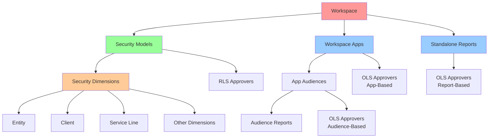
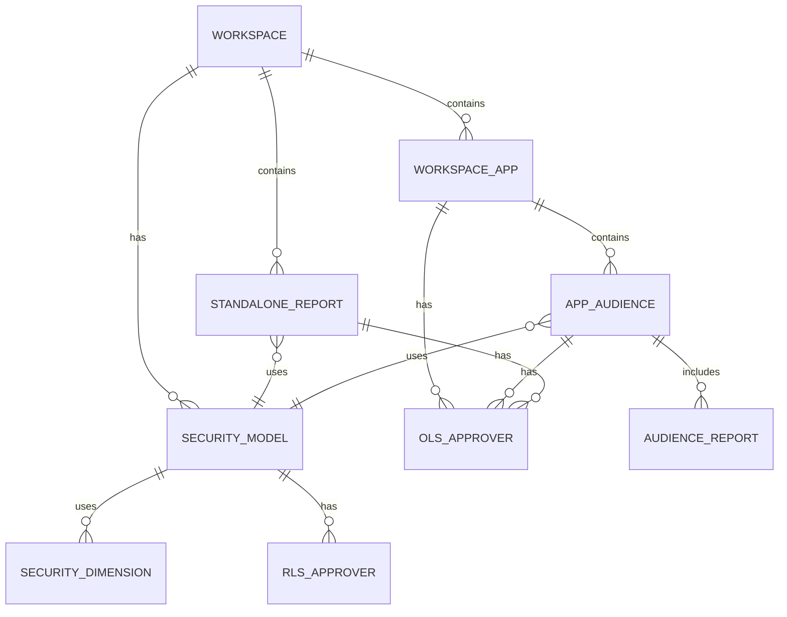
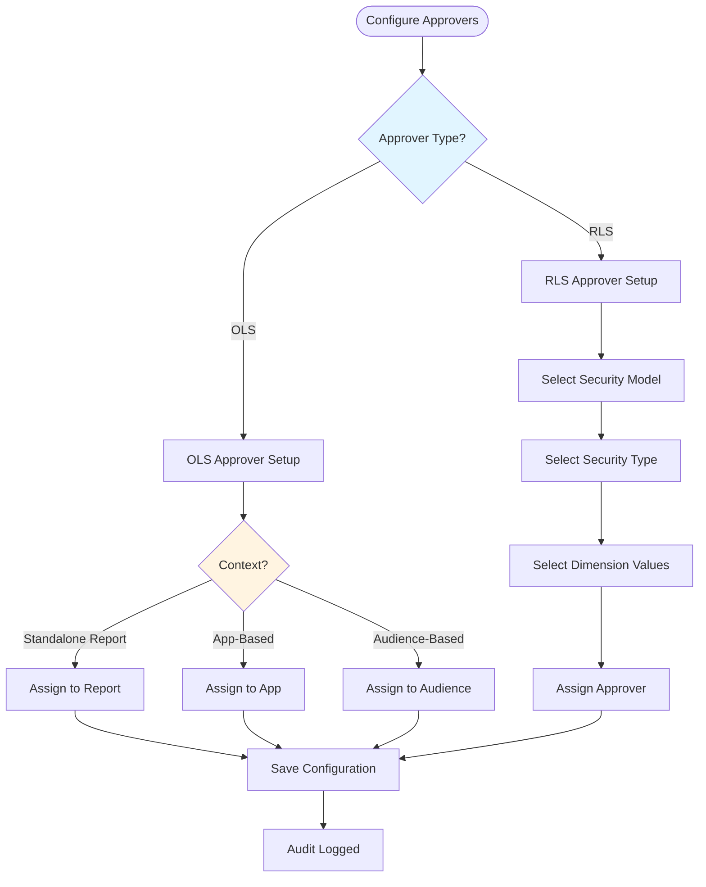

# Workspace Admin Role

## Overview

Users assigned as the **Workspace Owner** or **Workspace Tech Owner** to a Workspace by Administrator are granted administrative capabilities specific to the configuration and management of Workspace elements within the Sakura platform. This role plays a pivotal part in maintaining the underlying security structure and configuring how Sakura acts.

As a Workspace Admin, you are responsible for:
- Configuring security models and dimensions
- Managing reports and audiences
- Setting up approvers
- Maintaining workspace configuration

---

## Functional Capabilities

### Security Model Administration

- **Create and maintain Security Models** per Workspace
- **Define the logic and associations** that drive authorization
- **Map Security Models** to reports and audiences

### Security Dimension Management

- **Define and configure Security Dimensions** for each Workspace
- **Maintain mappings** between Security Dimensions and Security Models
- **Ensure dimensions are properly imported** from external systems

### Standalone Report Management

- **Add or edit Standalone Reports** within Workspaces
- **Deactivate outdated or deprecated reports**
- **Map reports to appropriate Security Models**
- **Configure OLS Approvers** for each report

### App & Audience Management

- **Register and manage Apps** published from Workspaces
- **Create, edit, and deactivate App Audiences**
- **Map App Audiences to relevant Security Models**
- **Configure approval modes** (AppBased vs AudienceBased)

### App Audience Report Management

- **Associate individual reports** with App Audiences for contextual delivery
- **Manage which reports** appear in which audiences
- **Ensure report-audience mappings** are correct

### Approver Configuration

- **Assign and manage Object-Level Security (OLS) Approvers**
  - For Standalone Reports
  - For Workspace Apps (if AppBased mode)
  - For App Audiences (if AudienceBased mode)

- **Assign and manage Row-Level Security (RLS) Approvers** for each dimension intersection
  - Define approvers for specific Security Dimension combinations
  - Ensure approvers are available for all required combinations

### Revocation of Access Requests

- **Revoke existing OLS or RLS access requests** that fall under their respective Workspaces
- This applies to permissions that were previously approved and are still active
- Requires a mandatory revocation reason

---

## Components Configured by Workspace Admins


*Figure 14 - Components that are configured by Workspace Admins*

A Workspace Owner is responsible for defining the following components in their workspace:

1. **Security Models** - Define RLS structure
2. **Security Dimensions** - Map dimensions to models
3. **Workspace Apps** - Register and configure apps
4. **App Audiences** - Create and manage audiences
5. **Standalone Reports** - Add and configure SARs
6. **OLS Approvers** - Assign approvers for object-level access
7. **RLS Approvers** - Assign approvers for data-level access

---

## All Actions Are Audited

All actions are performed via an administrative UI with appropriate validations, and every change is subject to audit tracking for compliance and traceability.

This means:
- Every configuration change is logged
- You can see who made what change and when
- Changes are traceable for compliance purposes

---

## Mental Model: Workspace Admin Responsibilities

### Your Role in the Ecosystem

As a Workspace Admin, you are the **architect** of your workspace's security structure:

```
You Define:
├── Security Models (how RLS works)
├── Security Dimensions (what data dimensions are used)
├── Reports (what content exists)
├── Apps & Audiences (how content is delivered)
└── Approvers (who approves what)
```

### Configuration Hierarchy



### Component Relationships



### Approver Setup Flow



### The Configuration Flow

1. **Set Up Security Foundation**
   - Define Security Models
   - Map Security Dimensions
   - Configure dimension hierarchies

2. **Register Content**
   - Add Standalone Reports
   - Register Workspace Apps
   - Create App Audiences
   - Associate reports with audiences

3. **Configure Approvers**
   - Assign OLS Approvers (for reports/audiences)
   - Assign RLS Approvers (for dimension combinations)

4. **Maintain and Update**
   - Keep reports current
   - Update approvers as needed
   - Deactivate outdated content

### Key Relationships

- **Security Model ↔ Dimensions:** A model uses specific dimensions
- **Report ↔ Security Model:** A report is linked to a security model
- **Audience ↔ Security Model:** An audience is linked to a security model
- **Approver ↔ Dimension Combination:** An approver approves specific dimension values

---

## Common Tasks

### Adding a New Report

1. Navigate to Workspace Reports section
2. Click "Add Standalone Report"
3. Enter report details
4. Select Security Model
5. Assign OLS Approver
6. Save

### Setting Up a New App Audience

1. Navigate to Workspace Apps section
2. Select the App
3. Go to Audiences
4. Click "Create Audience"
5. Enter audience details
6. Select Security Model
7. Assign OLS Approver (if AudienceBased mode)
8. Associate reports with audience
9. Save

### Configuring RLS Approvers

1. Navigate to Security Models section
2. Select the Security Model
3. Go to RLS Approvers
4. Click "Add Approver"
5. Select Security Type
6. Select dimension values
7. Assign approver email
8. Save

---

## Best Practices

1. **Plan Before Configuring** - Understand your workspace's security requirements
2. **Keep Approvers Current** - Update approvers when people change roles
3. **Document Your Structure** - Keep track of your security model design
4. **Test Before Going Live** - Verify configurations work as expected
5. **Regular Reviews** - Periodically review and clean up outdated content
6. **Coordinate with Stakeholders** - Work with report owners and data teams

---

## Workspace-Specific Considerations

Each workspace has unique requirements. Make sure you understand:
- Your workspace's Security Types (see [Workspace Requirements](02-workspace-requirements.md))
- Your workspace's dimension structure
- Your workspace's approval workflows

---

*[← Back to Approver Role](04-approver-role.md) | [Next: Sakura Support Role →](06-sakura-support-role.md)*
