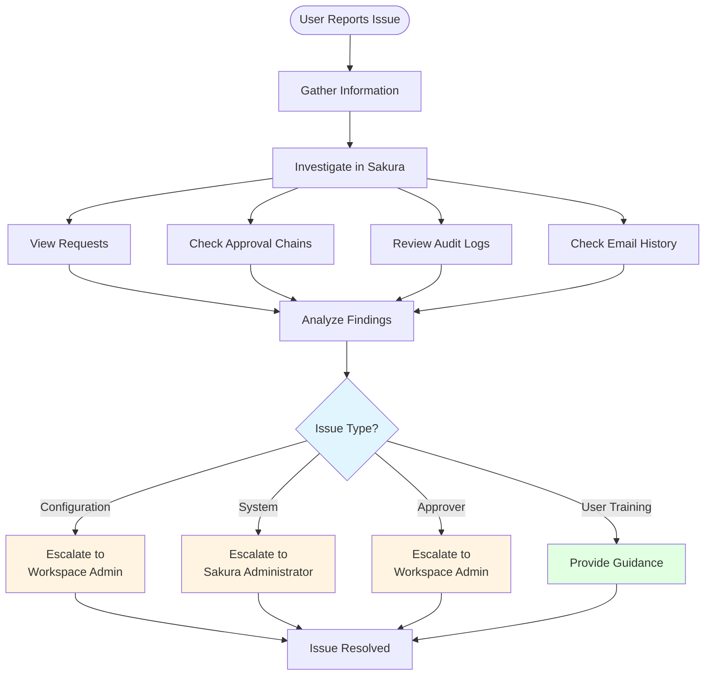
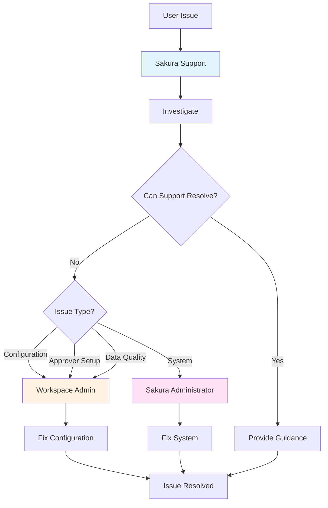

# Sakura Support Role

## Overview

The **Sakura Support** role is designed to provide visibility into the system for assistance purposes **without the ability to modify any data**. This role is strictly **read-only**, ensuring that support personnel can investigate issues and guide users in support cases without risking accidental changes to the system.

As Sakura Support, you can:
- View all requests and configurations
- Investigate issues
- Guide users
- Access audit logs

You **cannot**:
- Approve or reject requests
- Modify configurations
- Create or delete any objects

---

## Functional Capabilities (Read-Only)

### Request Visibility

- **View all RLS and OLS Requests** in the system
  - See request details, status, and history
  - View approval chains and current steps
  - Access request metadata

- **Cannot create, approve, reject, or modify** any request
  - You can view and investigate, but not take actions
  - Users must perform their own actions

### Approver Overview

- **See all defined RLS and OLS Approvers**
  - View who is assigned as approvers
  - See approver assignments by workspace
  - Understand approval structures

- **Cannot edit, add, or remove** any approvers
  - Approver management is done by Workspace Admins

### Object-Level Definitions

Access read-only views of:

- **Workspaces** - See all workspace configurations
- **Workspace Apps** - View app structures and settings
- **Workspace App Audiences** - See audience configurations
- **Standalone Reports** - View SAR definitions
- **Audience Reports** - See AUR mappings
- **Security Models and Security Dimensions** - Understand security structures

### System Emails

- **View historical and scheduled email messages** sent by the system
  - See what emails were sent and when
  - View email content and recipients
  - Useful for troubleshooting notification issues

### Audit & Logs

- **View audit trails and logs** generated by user and system actions
  - See who did what and when
  - Track configuration changes
  - Investigate issues and problems
  - Export logs for analysis

---

## Mental Model: Support Role Purpose

### Your Role

As Sakura Support, you are a **detective and guide**:

```
You Can:
├── Investigate issues (view everything)
├── Guide users (explain how things work)
├── Troubleshoot problems (check logs and emails)
└── Provide information (share what you see)

You Cannot:
├── Fix issues directly (no write access)
├── Approve requests (not your role)
└── Change configurations (admins do this)
```

### Support Investigation Process



### Escalation Path



### Common Support Scenarios

**Scenario 1: User Can't Find Their Request**
- You can view all requests
- Search for the user's request
- Explain where it is in the approval chain
- Guide them to the right place

**Scenario 2: Request Stuck in Approval**
- You can see the approval chain
- Identify where it's stuck
- Check if approver is assigned
- Guide user to contact approver

**Scenario 3: Email Not Received**
- You can check email logs
- See if email was sent
- Verify recipient address
- Help troubleshoot email delivery

**Scenario 4: User Doesn't Understand Access**
- You can view their existing access
- Explain what they have
- Show them how to request more
- Guide them through the process

---

## How to Help Users

### Investigation Process

1. **Gather Information**
   - What is the user trying to do?
   - What error or issue are they seeing?
   - When did it happen?

2. **Investigate in Sakura**
   - View relevant requests
   - Check approval chains
   - Review audit logs
   - Check email history

3. **Identify the Issue**
   - What's the root cause?
   - Is it a configuration issue?
   - Is it a workflow issue?
   - Is it a user error?

4. **Provide Guidance**
   - Explain what you found
   - Guide user to the solution
   - Escalate if needed (to Workspace Admin or Sakura Administrator)

### Escalation Paths

- **Configuration Issues** → Workspace Admin
- **System Issues** → Sakura Administrator
- **Approver Issues** → Workspace Admin (to update approvers)
- **User Training** → Provide guidance or documentation

---

## Tips for Support Personnel

1. **Use Read-Only Access Wisely** - You can see everything, use it to investigate thoroughly
2. **Document Your Findings** - Keep notes on common issues
3. **Guide, Don't Do** - Help users help themselves
4. **Know When to Escalate** - Some issues need admin intervention
5. **Understand the Workflows** - Know how requests flow through the system
6. **Check Logs First** - Often the answer is in the audit trail

---

*[← Back to Workspace Admin Role](05-workspace-admin-role.md) | [Next: Sakura Administrator Role →](07-sakura-administrator-role.md)*
