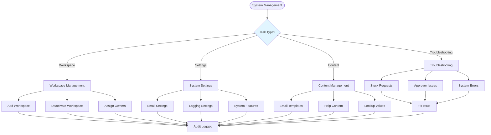
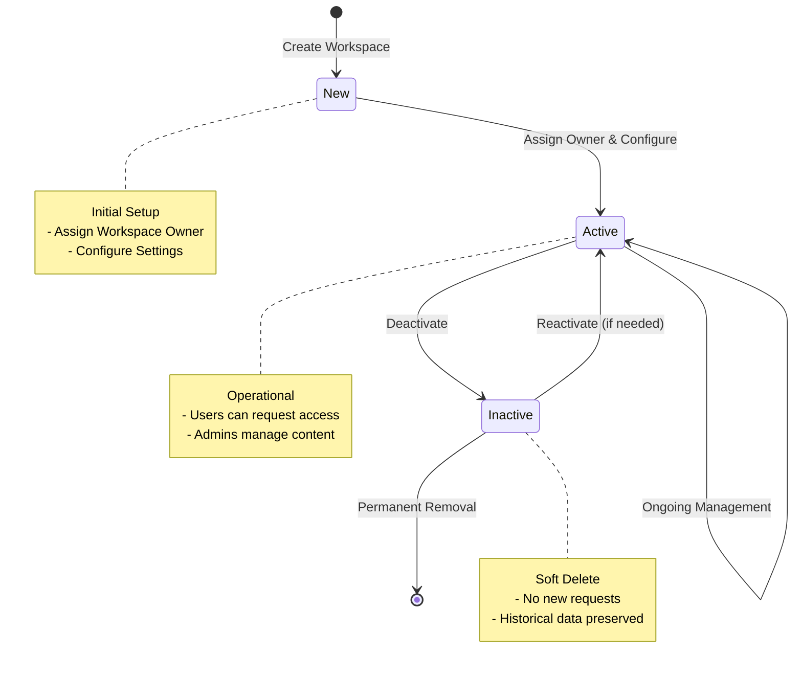

# Sakura Administrator Role

## Overview

The **Sakura Administrator** holds the highest level of control and system-wide configuration authority within the platform. While they do not participate in access approvals, they have visibility into and oversight over all Sakura functionalities.

As a Sakura Administrator, you are responsible for:
- System-wide configuration
- Workspace management
- Global settings
- System maintenance

---

## Functional Capabilities

### Global Permissions

- **Can perform all actions** available to other roles (e.g., Requesters, Workspace Admins)
- **Exception:** Cannot approve requests (that's for Approvers only)
- Full visibility into all system operations

### Request Support

- **Can append or inject RLS and OLS Approvers** into existing approval workflows
  - Useful for resolving stuck or misconfigured approval chains
  - Can fix approver assignment issues
  - Can add approvers even after request creation

### Workspace Management

- **Add new Workspaces** to Sakura
  - Register new Power BI workspaces
  - Configure workspace settings
  - Assign Workspace Owners

- **Deactivate (soft delete) Workspaces** no longer in use
  - Preserves historical data
  - Prevents new requests
  - Maintains audit trail

### System Configuration

Enable or disable platform-wide system settings such as:

- **Emailing** - Turn notifications on/off
- **Logging** - Control whether detailed logs are maintained
- **Other system-wide features**

### Lookup Management

- **Maintain system-wide List of Values (LoVs)** for dropdowns, filters, and configuration screens
- Ensure consistent data across the system
- Manage reference data

### Template and Content Management

- **Manage and update Email Templates** used for all automated communication
  - Customize email content
  - Ensure consistent messaging
  - Update templates as needed

- **Manage and update In-App Help Content** visible across Sakura interfaces
  - Add or modify help text
  - Update tooltips and guidance
  - Improve user experience

### Audit and Logging

- **Access all system logs and audit trails**
- **Export and share logs** when necessary for compliance, troubleshooting, or support
- Full visibility into all system activities

---

## Mental Model: Administrator Responsibilities

### Your Role in the Ecosystem

As a Sakura Administrator, you are the **system architect and maintainer**:

```
You Manage:
├── Workspaces (add/remove)
├── System Settings (global configuration)
├── Email Templates (communication)
├── Help Content (user guidance)
├── Lookup Values (reference data)
└── System Health (monitoring and maintenance)
```

### System Management Flow



### Workspace Lifecycle



### Key Responsibilities

1. **System Health**
   - Monitor system performance
   - Review logs for issues
   - Ensure system stability

2. **Workspace Onboarding**
   - Add new workspaces
   - Configure initial settings
   - Assign workspace owners

3. **Content Management**
   - Maintain email templates
   - Update help content
   - Manage lookup values

4. **Troubleshooting**
   - Resolve stuck requests
   - Fix approver issues
   - Support system operations

---

## Common Tasks

### Adding a New Workspace

1. Navigate to Workspace Management
2. Click "Add Workspace"
3. Enter workspace details
4. Configure settings
5. Assign Workspace Owner
6. Save

### Updating Email Templates

1. Navigate to Template Management
2. Select email template
3. Edit content
4. Preview changes
5. Save

### Resolving Stuck Requests

1. Identify stuck request
2. Review approval chain
3. Check approver assignments
4. Add or update approvers as needed
5. Request proceeds

---

## Best Practices

1. **Document Changes** - Keep records of system changes
2. **Test Before Production** - Verify changes in test environment
3. **Coordinate with Workspace Admins** - Work together on workspace setup
4. **Monitor System Health** - Regularly check logs and performance
5. **Keep Templates Updated** - Ensure communication is current
6. **Maintain Help Content** - Keep user guidance accurate

---

## Security Considerations

As a Sakura Administrator, you have extensive access. Remember:

- **Use power responsibly** - Your actions affect the entire system
- **Follow change management** - Document and communicate changes
- **Respect workspace autonomy** - Let Workspace Admins manage their workspaces
- **Maintain audit trail** - All your actions are logged

---

*[← Back to Sakura Support Role](06-sakura-support-role.md) | [Next: Common Functionality →](08-common-functionality.md)*
