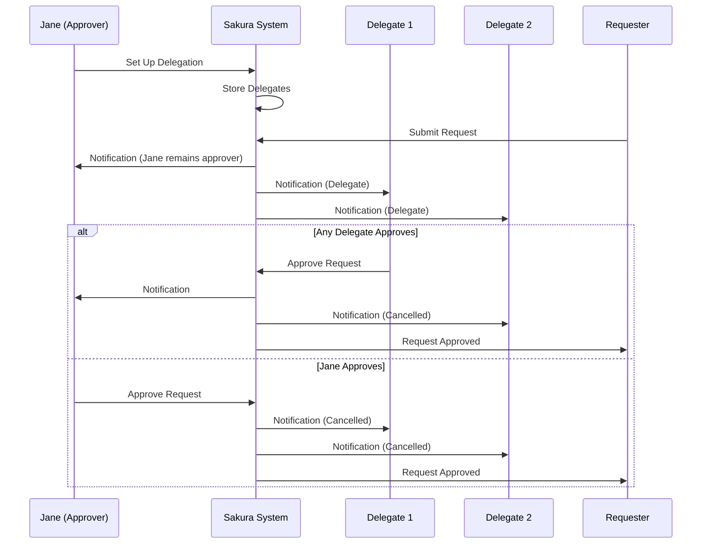
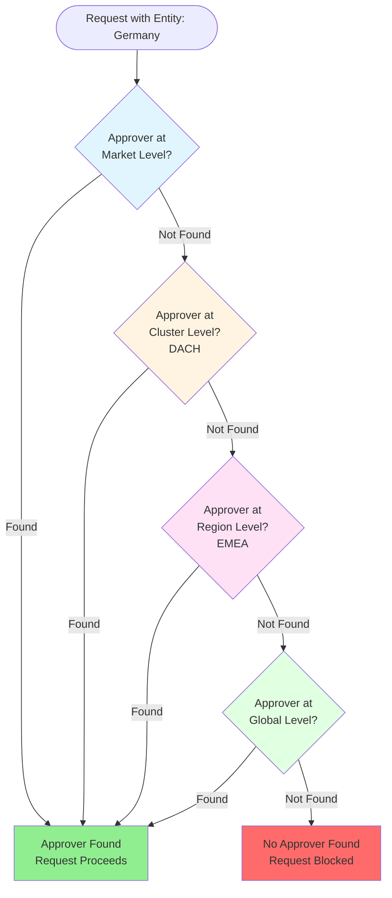
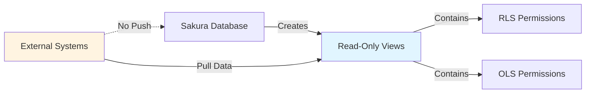
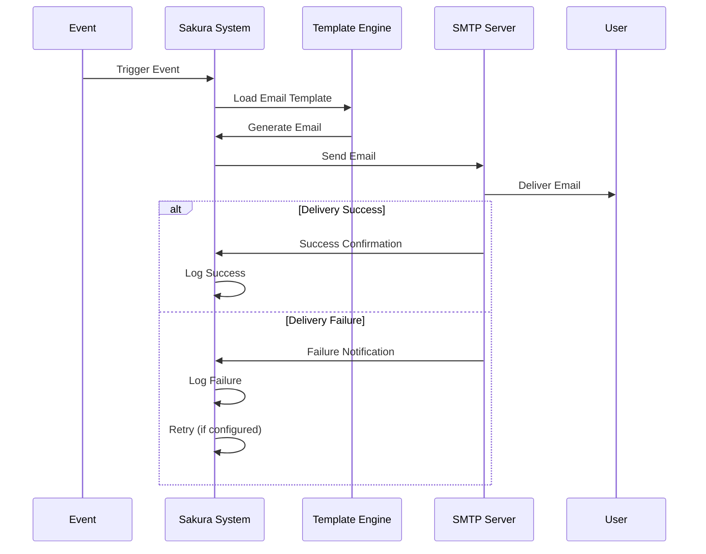

# Common Functionality

This section covers features and functionality that are shared across multiple roles in Sakura.

---

## Delegations

Delegation allows approvers to assign someone else to approve requests on their behalf when they're unavailable.

### Key Rules

- **Only Approvers can delegate** - Other roles do not have delegation abilities
- **Self-delegation only** - Approvers can assign a delegate only for themselves. Delegating on behalf of another user is not permitted
- **Forward-looking only** - Delegation only applies to new requests created during the delegation period. It does **not** retroactively affect existing or pending requests

### How It Works

For example, if **Jane** is taking a sabbatical for the next three months and wants **John** to act as her delegate:

1. Jane logs into Sakura
2. Goes to her **Profile Page**
3. Assigns John under the **Delegates** section
4. Can assign multiple delegates by entering email addresses separated by semicolons (e.g., `john@dentsu.com; joe@dentsu.com`)

### During the Delegation Period

- Any new request where Jane is the designated approver will also include her assigned delegates as approvers
- **Jane remains listed as an approver** so she can still view and act on requests created in her absence, if needed
- **Any one of the listed delegates** can take the approval action - only **one** approval is required
- Sakura supports only **"any of"** delegation logic. More complex scenarios like **"both of"** delegates needing to approve are currently **out of scope** (see [Out of Scope](09-out-of-scope.md))

### Delegation Flow

---

## Traversing The Approver Tree Based on Security Dimension Attributes

Sakura includes a traversal mechanism within its approver-finding algorithm for **Security Models that use "Entity" as a Security Dimension**. This mechanism ensures that if no direct approver is found for a given request, the system will attempt to locate an approver at higher levels of the organizational hierarchy.

### How It Works

1. When a request is submitted with a specific **Entity** selection (e.g., a Market like "Germany"), Sakura first checks for an exact approver match at that most granular level

2. If no approver is found, the system **traverses upward** in the predefined entity tree:
   - From Market (e.g., *Germany*)
   - To Cluster (e.g., *DACH*)
   - To Region (e.g., *EMEA*)
   - And finally, to the *Global* level

3. At each level, Sakura attempts to match the selected Security Dimension combination to a defined approver

### Failure Scenario

- If no approver is found at **any** level of the entity hierarchy, the algorithm returns a **"NOT FOUND"** result
- In such cases, the request will **not proceed** - permission creation is blocked until an appropriate approver is defined

### Important Note

This traversal mechanism is applicable **only to Entity-based Security Models**. Other dimensions do not benefit from hierarchical fallback.

### Approver Tree Traversal

---

## Auditing and Logging

Every administrative or user-driven change (e.g., request submission, approval actions, configuration edits) is logged in an auditable, timestamped format.

### Key Audit Features

- **Change logs per object** (Report, Audience, Security Model, etc.)
- **Historical records** of granted and revoked access
- **Exported Records** using Excel Export Functionality
- **View Action for Requests** - All request views are logged
- **Traceability** of all approval and delegation actions
- **View and exportable audit trails** for compliance purposes

**Simple rule:** Sakura logs everything related to who did what, when and how.

---

## Excel Export

Within Sakura, exporting to Excel is by default forbidden. However, due to various business reasons, Sakura provides Excel exports for various tables:

- RLS Requests
- OLS Requests
- RLS Approvers
- Workspace
- Workspace Apps
- Workspace App Audiences
- Workspace App Reports

All exports are governed by user permissions and traceable through audit logs.

---

## Access using OKTA and MS Entra

Authentication and access to Sakura is managed via SSO (Single Sign-On), supporting:
- **Okta**
- **Microsoft Entra ID**

User context is validated via secure tokens. All users must authenticate before accessing Sakura.

---

## Data Sharing with External Parties

Sakura Database exposes **read-only views** of security and permissions data for integration with other systems.

### Important Rules

- Sakura does **not push** any data externally
- External systems are responsible for **pulling data** from these prepared views
- Only permissions-related metadata (not report data or datasets) is shared

### Output Types

At the end of the access request lifecycle, Sakura produces two types of finalized outputs for each user:

#### RLS (Row-Level Security) List

RLS definitions capture the specific data-level access granted to the user across models and security types. These are interpreted by the downstream system for enforcing data visibility.

**Example:** When Jane opens a report, she can view data where she has approved access to:
- Germany CXM as Orga, and/or
- Germany Media as Orga, and/or
- Germany Creative Mercedes as Client

**RLS Data Sharing Format:**

| Dimension I | Dimension II | Dimension ... | Dimension n | Requested For | Security Type | Approved By | Approval Date |
|-------------|--------------|---------------|-------------|--------------|---------------|-------------|---------------|
| Value I | Value II | Value ... | Value n | user@dentsu.com | SL/MSS/Client etc. | approver@dentsu.com | dd.MM.yyyy hh:mm:ss |

#### OLS (Object-Level Security) List

OLS definitions capture which reports, applications, or audiences the user is allowed to open.

**Example:** Jane has access to reports that are:
- under Finance Audience in Samurai App, and/or
- in DWI App, and/or
- a standalone report in CDI Workspace

**OLS Data Sharing Format:**

| Catalogue Item Type | Catalogue Item | Workspace App | Requested For | Approval Date |
|---------------------|----------------|--------------|---------------|---------------|
| Report | Report Details | App Details | user@dentsu.com | dd.MM.yyyy hh:mm:ss |
| Audience | Audience Details | App Details | user@dentsu.com | dd.MM.yyyy hh:mm:ss |

> **Note:** Both RLS and OLS formats should be taken as samples and could be completely changed during the development phase, based on development priorities. Therefore, do not take these as final outcomes.

---

## Data Imports for Security Dimensions

Security Dimensions are **not created or maintained within Sakura**. Therefore, the necessary data must be imported into Sakura from external systems.

### Import Process

- Sakura performs imports periodically using **Microsoft Azure Data Factory (ADF)**
- All imported Security Dimensions are subject to **historization and versioning** to ensure full traceability and auditability

### Line Manager Data

In addition to Security Dimensions, **Line Manager** information is also imported from UMS. This data is used in the approval process to dynamically determine the requester's line manager.

---

## Emailing and Notifications

Sakura communicates key events to users via email, leveraging a standardized notification system that is fully configurable through system settings.

### Delivery Scope

- Sakura can send emails **only to dentsu-owned domains**, as restricted by the SMTP relay server configuration

### Configurable Parameters

Administrators can configure the following email settings via the system configuration panel:

- Whether emails should be sent or suppressed
- Email frequency and retry attempts
- Sender address
- Email subject tags (prefixes)

### Email Triggers

Sakura sends emails for the following events:

- **When a request is created:** Notifications are sent to both the person who created the request (*RequestedBy*) and the person the request was created for (*RequestedFor*)
- **When a request requires approval:** Notifications are sent to the designated Approvers
- **When a request is approved or rejected:** Both *RequestedBy* and *RequestedFor* are informed
- **When a user is assigned as an Approver:** Notification is sent based on the relevant system setting

### Templates and Format

- All emails are generated using predefined, standardized templates to ensure consistency in tone and structure
- Templates are managed by Sakura Administrators

### Retry and Logging Mechanism

- Sakura retries sending undelivered emails a configurable number of times, as defined in the system settings
- Both pending and successfully delivered emails are logged and stored in a dedicated internal table for traceability and auditing purposes

---

## In-App Help

Sakura provides contextual, in-application help to guide end users in understanding various interface elements and actions.

### Functionality Overview

- Help is delivered through **information bubbles** that appear when users hover over specific elements on the page with their mouse
- These tooltips provide short, descriptive explanations about the purpose or behavior of the corresponding UI element

### Configuration

- Help bubbles can be configured for any UI element on any page within Sakura
- The help content is defined and managed exclusively by Sakura Administrators, typically upon request from stakeholders or users

Through this mechanism, Sakura tries to enhance usability and reduce the number of questions for end users by offering lightweight, embedded guidance directly within the application.

---

## Revocation

Revocation refers to the cancellation of an existing access request that is currently in an Approved (or earlier) state.

### Key Rules and Behavior

- Once a request is revoked, it is **permanently cancelled** and cannot be reactivated. If access is still required, a new request must be submitted
- Revocations are done **per RLS or OLS separately**

### Who Can Revoke

Revocation can only be performed by users with one of the following roles:

- **Approver** (OLS and RLS Approvers only)
- **Workspace Admin**
- **Sakura Administrator**

### Permissions by Role

- **Approvers and Workspace Admins** can only revoke requests within their own authorization scope (e.g., for requests they were responsible for approving)
- **Sakura Administrator** has global authority and can revoke any request regardless of scope

### Audit and Notifications

- A **revocation reason is mandatory** and must be provided during the revocation process
- This reason, along with the identity of the user who performed the revocation, is:
  - Logged on the request record
  - Included in the email notification sent to:
    - **To:** Requested For
    - **CC:** Requested By (if different than Requested For)
    - **CC:** Line Manager (if different than Requested By)

---

## Mental Model: Common Features

### Delegation = Backup Approver

Think of delegation as setting up a backup:
- You're going away → Set up delegate
- Requests come in → Delegate can approve
- You return → Remove delegate

### Approver Traversal = Escalation

Think of approver traversal as an escalation path:
- No approver at Market level? → Check Cluster
- No approver at Cluster? → Check Region
- No approver at Region? → Check Global
- No approver anywhere? → Request blocked

### Audit Trail = Complete History

Everything is logged:
- Who did what
- When they did it
- What changed
- Why it changed (if reason provided)

### Data Sharing Flow

### Email Notification Flow

---

*[← Back to Sakura Administrator Role](07-sakura-administrator-role.md) | [Next: Out of Scope →](09-out-of-scope.md)*
