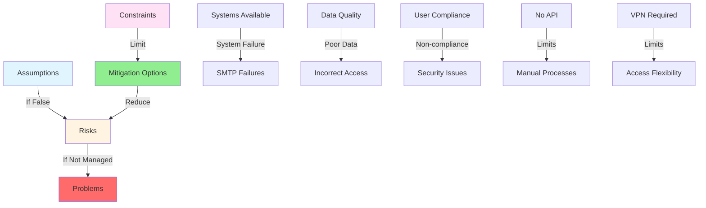
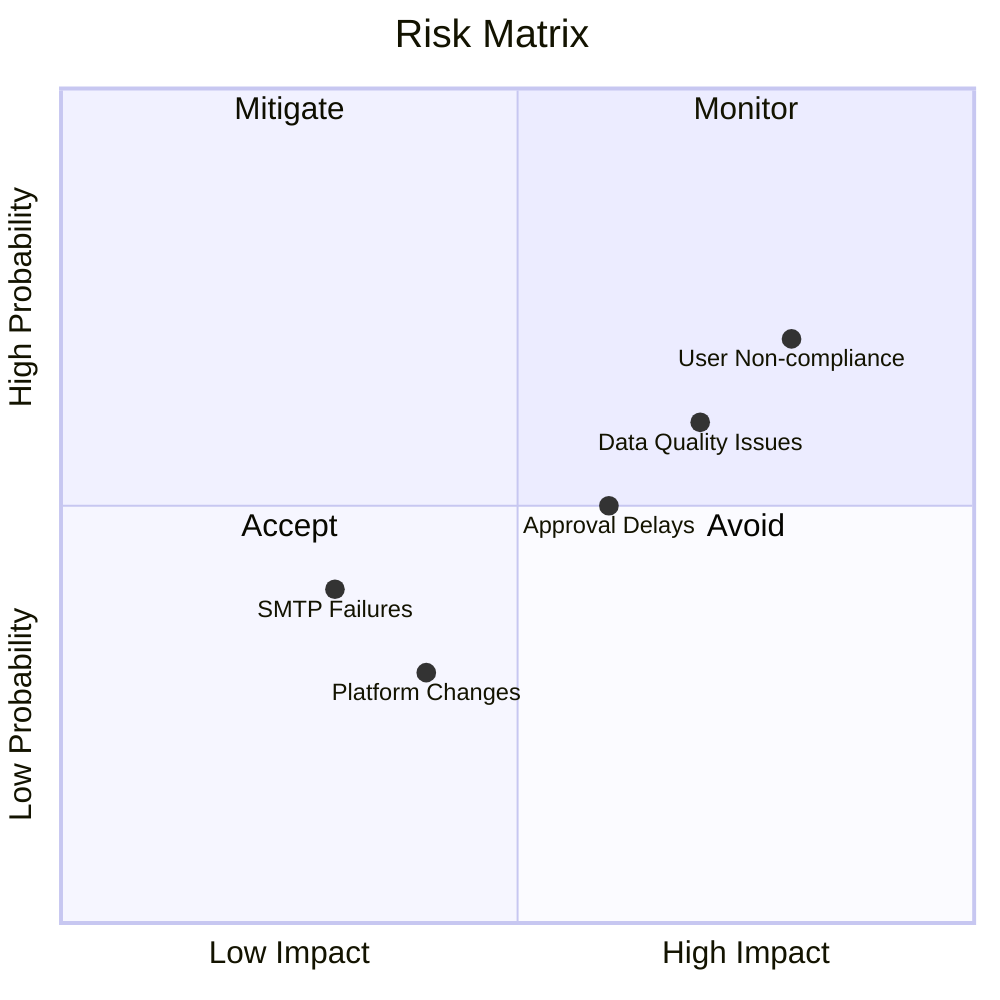

# Assumptions, Risks, and Constraints

## Assumptions and Constraints

These are considered true for the scope of this project:

### Infrastructure and Integration

- **Active Directory integration** is available, queryable and up to date
- **Email notifications** rely on the organization's SMTP server uptime
- **Users access the system** within a secure network environment, such as via VPN or directly from the office
- **All Security Dimensions** are sourced from relational SQL Systems accessible within dentsu network using SQL Server Authentication

### Data and Systems

- **Data required by Sakura** is properly shaped and mapped to the Security Dimensions by responsible owners
- **Downstream Data sharing** with external parties is handled via Views in Sakura Database. External Parties have the necessary tools to extract data from Sakura Database
- **Upstream systems** providing source data are assumed to be stable and resilient, with any failures handled outside the scope of Sakura

### User Interface

- **UI is desktop-optimized**, and mobile accessibility is limited in the initial release

### Process and Governance

- **Stakeholder requirements** have been collected, finalized and signed off
- **Proper in-advance delegation planning** (e.g., due to unavailability) is expected to be proactively managed by the admins (Workspace/App) to ensure functional continuity of Sakura
- **Stakeholders are aligned**, well-coordinated, and have reached consensus on access management responsibilities, security requirements, and process ownership. In the event of disagreements or conflicts, they can collaborate constructively to reach resolution in a short time
- **All individuals** configuring or using the Sakura are expected to act in good faith and in solidarity with the goals and responsibilities defined by the organization

---

## Risks

These are the risks which might affect the Sakura process:

### Technical Risks

- **SMTP email delivery failures** may delay or prevent critical system notifications
- **Changes in Microsoft Power BI's platform** could affect future system compatibility
- **VPN dependency** may limit access flexibility for some users

### Data and Integration Risks

- **Inconsistent understanding or interpretation** of Security Dimensions may lead to incorrect access grants or denials
- **Lack of support for non-relational SQL sources** limits data model flexibility
- **Absence of data mapping and shaping** at source increases the risk of inconsistent integration
- **Poor data quality** may propagate errors or create misleading access decisions and functionality of Sakura
- **Exclusion of external network sources** and upstream system resiliency may result in failed requests or inaccessible datasets during outages

### Process and Operational Risks

- **Delegation and cleanup activities** rely on manual actions, and it is expected that responsible individuals are aware of changes and perform them accurately and in a timely manner
- **Delays in access approvals** may occur if Workspace and App Administrators do not actively monitor pending requests, as there is no automated SLA enforcement or escalation in Sakura. Responsibility for timely action lies with the respective administrators
- **Possible delays and malfunction** due to absence / unavailability of admins (Workspace / App) in access processing

### Organizational Risks

- **Misalignment, lack of coordination, or absence of consensus** among stakeholders may lead to delays, conflicting requirements, or unclear ownership in access and security processes
- **Misuse, negligence, or lack of cooperation** by users or administrators may compromise the integrity of the system, leading to access issues, audit gaps, or weakened security enforcement

---

## Risk Mitigation Strategies

### For Technical Risks

- Monitor email delivery and have fallback notification mechanisms
- Stay informed about Power BI platform changes and plan for compatibility updates
- Provide clear VPN setup instructions and support

### For Data and Integration Risks

- Provide comprehensive training on Security Dimensions
- Establish clear data quality standards and validation processes
- Document integration requirements clearly

### For Process and Operational Risks

- Establish clear delegation procedures and documentation
- Implement regular monitoring and reporting on pending approvals
- Have backup administrators identified for each workspace

### For Organizational Risks

- Maintain regular stakeholder communication and alignment meetings
- Provide comprehensive training and documentation
- Establish clear governance and escalation procedures

---

## Constraints

### Technical Constraints

- **Desktop-optimized UI** - Mobile support is limited
- **VPN requirement** for remote access
- **Relational SQL sources only** - No Excel or non-relational data sources
- **No API access** - All actions must be performed via UI

### Process Constraints

- **No bulk operations** - Individual requests only
- **No automatic data migration** - Manual migration required
- **No SLA enforcement** - Manual follow-up required
- **Sequential approvals** - Cannot skip approval steps

### Business Constraints

- **Time constraints** - Some features deferred to future releases
- **Resource constraints** - Limited development capacity
- **Security constraints** - VPN and network restrictions

---

## Mental Model: Understanding Assumptions, Risks, and Constraints

### Assumptions = What We're Counting On

These are things we assume will be true:
- Systems will be available
- Data will be clean
- People will follow processes

### Risks = What Could Go Wrong

These are potential problems:
- Systems might fail
- Data might be bad
- People might not follow processes

### Constraints = What We Can't Do

These are limitations:
- Technical limitations
- Process limitations
- Business limitations

### The Relationship

### Risk Matrix

---

*[← Back to Out of Scope](09-out-of-scope.md) | [Next: Appendix →](11-appendix.md)*
