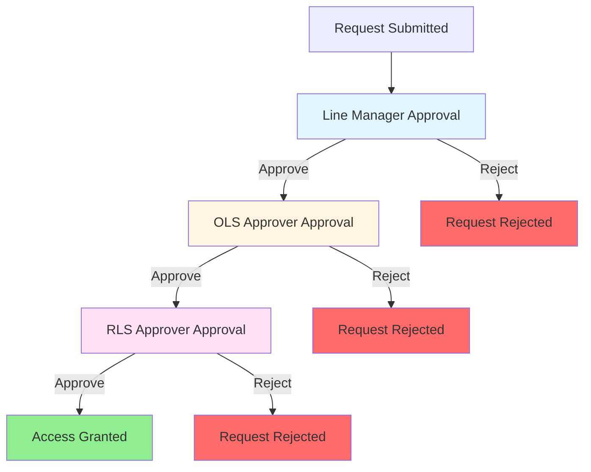
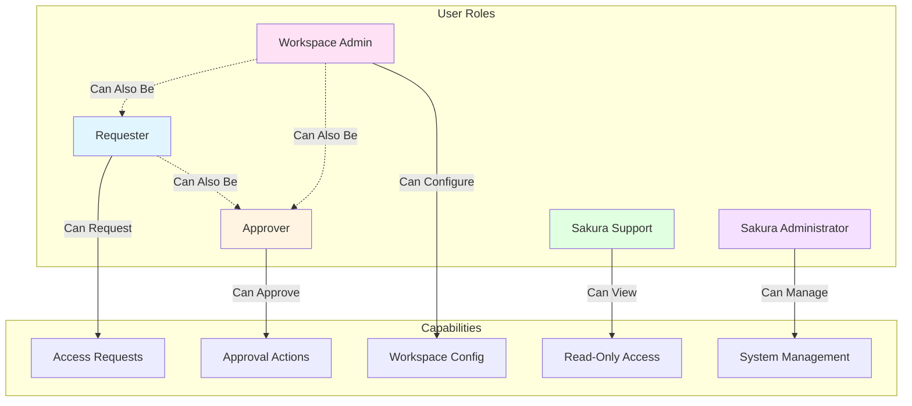

# Appendix

## Glossary and Acronyms

| Term / Acronym | Description |
|----------------|-------------|
| **OLS** | Object Level Security -- Report/Audience visibility to users, simply it is about which reports can a user see |
| **RLS** | Row Level Security -- Data visibility when someone opens a report, simply it is about which data is shown when user opens a report |
| **WS** | Workspace |
| **WSA** | Workspace Admins (aka WS Owners & WS Tech Owners) |
| **LM** | Line Manager |
| **PBI** | Power BI |
| **MS** | Microsoft |
| **SAR** | Standalone Report |
| **AUR** | Audience Report |
| **WSO / WS Owner** | Workspace Owner -- responsible for a Power BI and Sakura workspace |
| **Approver** | A role that approves access based on assigned dimension (RLS), definitions (OLS + LM) |
| **DWH** | Datawarehouse |
| **PC** | Profit Center |
| **CC** | Cost Center |
| **ORGA** | Organization |
| **MSS** | Master Service Set |
| **SL** | Service Line |
| **PA** | Practice |
| **CDI** | Client Data Insights |
| **FUM** | Finance Unified Model |
| **WFI** | Workforce Insights |
| **AMER** | Americas |
| **EMEA** | Europe, Middle East and Africa |
| **GI** | Growth Insights |

---

## Diagrams

### Access Request Flow

#### Using Report Catalogue

*Figure 15 - Access Request Wizard Using Report Catalogue*

#### Advanced Mode

*Figure 16 - Access Request Wizard Advanced Mode*

### Overview Request Workflow

*Figure 17 - Overview Request Workflow*

### All Security Objects Diagram

*Figure 18 - All Security Objects Diagram*

---

## Role-Functionality Matrix

The table below outlines which functionalities in Sakura are available to which user roles. This mapping is based on the descriptions provided in the role-specific sections. An "X" indicates that the functionality is available to the respective role.

**Note:** Some roles such as Sakura Support are limited to read-only access for visibility and troubleshooting purposes. Administrative actions are reserved for Workspace Admins and Sakura Administrators. Approvers act only within the approval workflow.

| Functionality | Requester | Approver | Workspace Admin | Sakura Support | Sakura Administrator |
|---------------|-----------|----------|-----------------|----------------|----------------------|
| Request access for themselves | X | X | X | X | X |
| Request access for someone | X | X | X | X | X |
| View existing access of themselves | X | X | X | X | X |
| View existing access of someone (within their context only) | | X | X | X | X |
| Viewing existing access of someone from all contexts | | | | X | X |
| Approve Requests | | X | | | |
| Append an Approver to an existing access request | | | X | | X |
| Approve using email | | X | | | |
| Revoke existing access | | X | X | | X |
| Delegate | | X | | | X |
| Create or Delete a Workspace | | | | | X |
| View Workspaces | | | X | X | X |
| Manage Apps & Audiences in WS | | | X | | X |
| Manage AUR in WS | | | X | | X |
| Manage SAR in WS | | | X | | X |
| Configure OLS Approvers | | | X | | X |
| Administer Security Models | | | X | | |
| Configure RLS Approvers | | | X | | |
| Manage Security Dimensions | | | | | X |
| View Emails Sent by Sakura | | | | X | X |
| Export Requests to Excel | | | | | X |
| Configure In-App Help | | | | | X |
| Configure System Settings | | | | | X |
| Manage Email Template | | | | | X |

---

## Document Information

### Version History

| Version | Date | Author | Change Summary |
|---------|------|--------|----------------|
| 1.0 | 05.08.2025 | O. Ozturk | Initial Version |

### Signoff Status

| Stakeholder | Date | Status | Comments |
|------------|------|--------|----------|
| Kate Rudwick | 08.08.2025 | Awaiting Approval | |
| Nico Benga | 08.08.2025 | Approved pending observations | See comments in document |
| Nitin Menon | 08.08.2025 | Awaiting Approval | |
| Safraz Hakamali | 08.08.2025 | Awaiting Approval | |
| Ken Lovingood | 08.08.2025 | Awaiting Approval | |
| Patrick Sura | 08.08.2025 | Awaiting Approval | |

---

## Additional Resources

### Related Documents

- Sakura Security Access -- Requirements Document
- Workspace-specific requirements documents
- Power BI documentation
- Microsoft Fabric documentation

### Support Contacts

- **Workspace Owners:** See [Workspace Requirements](02-workspace-requirements.md) for workspace-specific contacts
- **Sakura Support:** Create a Sakura App Support Case via GoTo
- **Technical Issues:** Contact your Workspace Technical Owner

---

## Quick Reference

### Approval Flow

### Role Relationships

### Request Types

- **OLS Request:** Access to a report/audience (what you can see)
- **RLS Request:** Access to specific data (what data you see)

### Report Types

- **SAR (Standalone Report):** Report shared directly with users
- **AUR (Audience Report):** Report delivered via App Audience

### Security Types (by Workspace)

- **GI:** SL/PA, MSS
- **CDI:** CDI (single)
- **WFI:** WFI (single)
- **EMEA:** Orga-SL/PA, Client, CC, Country, Orga-MSS
- **AMER:** Orga, Client, CC, PC
- **FUM:** TBD

---

*[← Back to Assumptions, Risks, and Constraints](10-assumptions-risks-constraints.md) | [Back to README →](README.md)*
