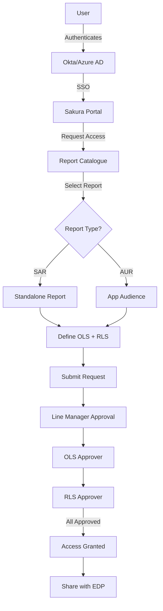
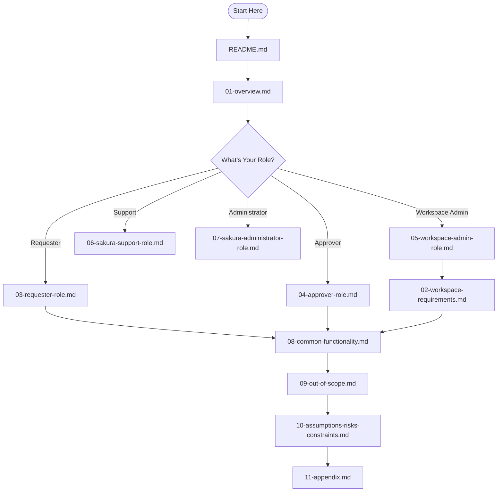

# Sakura V2 - Functional Design Document

**Version:** 1.0  
**Date:** 05.08.2025  
**Author:** O. Ozturk

---

## 📋 Document Overview

This documentation provides a comprehensive guide to the Sakura V2 application - a self-service authorization management portal designed for users within the dentsu organization to request, approve, and manage access to Power BI reports and datasets.

Sakura supports both **Object-Level Security (OLS)** and **Row-Level Security (RLS)** across multiple delivery contexts, including Standalone Reports, Workspace Apps, and App Audiences.

---

## 🗺️ Navigation Guide

This documentation is organized into logical sections to help you build a clear mental model of the system:

### 1. [Overview](01-overview.md)
Start here to understand:
- Purpose and scope of Sakura
- System architecture and components
- Key definitions and concepts
- User roles and responsibilities

### 2. [Workspace Requirements](02-workspace-requirements.md)
Learn about workspace-specific configurations:
- RLS requirements for each workspace (FUM, GI, CDI, WFI, EMEA, AMER)
- Security dimensions and workflows
- Workspace-specific approval processes

### 3. [Requester Role](03-requester-role.md)
For end users requesting access:
- How to request access (Guided and Advanced modes)
- Viewing existing access
- Notifications and email communications

### 4. [Approver Role](04-approver-role.md)
For users who approve requests:
- Types of approvers (Line Manager, OLS, RLS)
- Approval workflows and processes
- Approval interfaces and email approvals

### 5. [Workspace Admin Role](05-workspace-admin-role.md)
For workspace administrators:
- Security model administration
- Report and audience management
- Approver configuration

### 6. [Sakura Support Role](06-sakura-support-role.md)
For support personnel:
- Read-only access capabilities
- Troubleshooting and assistance features

### 7. [Sakura Administrator Role](07-sakura-administrator-role.md)
For system administrators:
- Global system configuration
- Workspace management
- System-wide settings

### 8. [Common Functionality](08-common-functionality.md)
Shared features across all roles:
- Delegations
- Auditing and logging
- Excel exports
- Email notifications
- Data sharing

### 9. [Out of Scope](09-out-of-scope.md)
Features not included in V2:
- Shopping cart experience
- Bulk imports
- API access
- And more...

### 10. [Assumptions, Risks, and Constraints](10-assumptions-risks-constraints.md)
Project assumptions and potential risks

### 11. [Appendix](11-appendix.md)
Reference materials:
- Glossary and acronyms
- Diagrams and visual references
- Role functionality matrix

---

## 🎯 Quick Start Guide

**New to Sakura?** Follow this path:
1. Read [Overview](01-overview.md) to understand the system
2. Review [Requester Role](03-requester-role.md) if you need to request access
3. Check [Common Functionality](08-common-functionality.md) for shared features

**Are you an Approver?**
1. Start with [Overview](01-overview.md)
2. Read [Approver Role](04-approver-role.md)
3. Review [Common Functionality](08-common-functionality.md) for delegation features

**Are you a Workspace Admin?**
1. Read [Overview](01-overview.md)
2. Review [Workspace Requirements](02-workspace-requirements.md) for your workspace
3. Study [Workspace Admin Role](05-workspace-admin-role.md)

---

## 📊 Key Concepts

### Object-Level Security (OLS)
Controls **which reports** a user can see. This includes:
- Standalone Reports (SAR)
- Workspace App Audiences (AUR)

### Row-Level Security (RLS)
Controls **which data** a user can see when they open a report. Based on:
- Security Dimensions (Entity, Client, Service Line, etc.)
- Security Types (varies by workspace)

### Approval Flow
All requests follow a three-step approval process:
1. **Line Manager** → 2. **OLS Approver** → 3. **RLS Approver**

### System Overview

### Documentation Navigation Flow

---

## 📝 Document Status

| Stakeholder | Date | Status | Comments |
|------------|------|--------|----------|
| Kate Rudwick | 08.08.2025 | Awaiting Approval | |
| Nico Benga | 08.08.2025 | Approved pending observations | See comments in document |
| Nitin Menon | 08.08.2025 | Awaiting Approval | |
| Safraz Hakamali | 08.08.2025 | Awaiting Approval | |
| Ken Lovingood | 08.08.2025 | Awaiting Approval | |
| Patrick Sura | 08.08.2025 | Awaiting Approval | |

---

## 🔍 How to Use This Documentation

1. **Start with Overview** - Build your foundation
2. **Read your role-specific section** - Understand your responsibilities
3. **Reference Common Functionality** - Learn shared features
4. **Check Out of Scope** - Know what's not included
5. **Use Appendix** - Quick reference for terms and diagrams

---

## 📞 Support

For questions or issues:
- Use the "Help Me" feature in Sakura (for requesters)
- Contact your Workspace Owner (for workspace-specific questions)
- Create a Sakura App Support Case via GoTo (for technical issues)

---

*Last Updated: August 2025*
