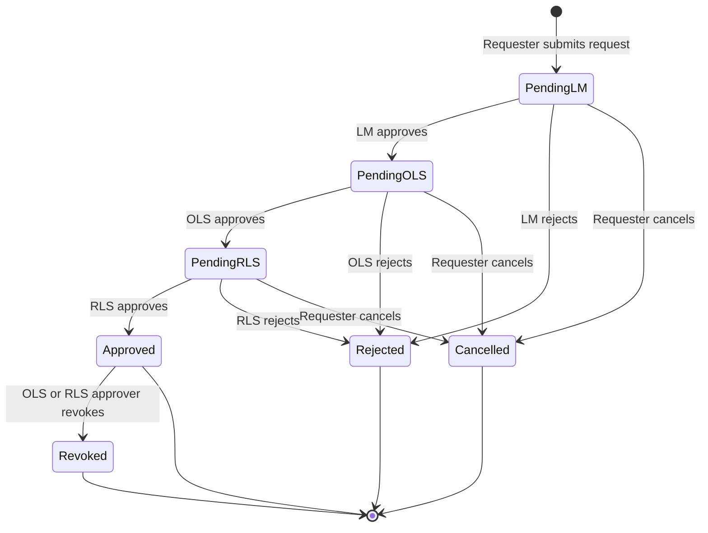

# Request lifecycle – all possible states

This document describes every state a request can be in, from creation to a final outcome (approved, rejected, revoked, or cancelled), in a simple way.

---

## Quick reference: the 7 states

| Code | State        | Who can act | Meaning |
|------|--------------|-------------|---------|
| **0** | **Pending LM**  | Line Manager, Requester | Waiting for Line Manager to approve or reject. Requester can cancel. |
| **1** | **Pending OLS** | OLS Approver, Requester | LM approved; waiting for OLS Approver. Requester can cancel. |
| **2** | **Pending RLS** | RLS Approver, Requester | OLS approved; waiting for RLS Approver. Requester can cancel. |
| **3** | **Approved**    | OLS/RLS Approvers | All stages approved; access granted. Approvers can revoke. |
| **4** | **Rejected**   | — | Someone in the chain rejected the request. **Final.** |
| **5** | **Revoked**    | — | Was approved, then an approver revoked it. **Final.** |
| **6** | **Cancelled**  | — | Requester withdrew the request while it was still pending. **Final.** |

---

## State diagram (all possible paths)



---

## Simple flow (left to right)

```
  CREATE          PENDING (in order)              OUTCOMES (final)
    │                    │                              │
    ▼                    ▼                              ▼
┌─────────┐      ┌─────────────┐                 ┌─────────────┐
│ Submit  │ ──►  │ Pending LM  │ ── approve ──►  │ Pending OLS │
│ request │      │             │ ── reject  ──►  │             │
└─────────┘      │ (requester  │ ── cancel  ──►  └──────┬──────┘
                 │  can cancel)│       │                │
                 └─────────────┘       ▼                ▼
                                ┌──────────┐    ┌─────────────┐
                                │ CANCELLED│    │ Pending RLS │
                                └──────────┘    │             │
                                                │ (requester  │
                                                │  can cancel)│
                                                └──────┬──────┘
                                                       │
              approve                                  ▼
         ┌─────────────────────────────────────► ┌──────────┐
         │                                       │ APPROVED │
         │                                       │ (access  │
         │                                       │  granted)│
         │                                       └────┬─────┘
         │                                            │
         │  reject                                    │ revoke
         │  (at any stage)                             │ (OLS/RLS)
         ▼                                            ▼
    ┌──────────┐                                ┌──────────┐
    │ REJECTED │                                │ REVOKED  │
    └──────────┘                                └──────────┘
```

---

## Who can do what, and when

| State        | Requester | Line Manager | OLS Approver | RLS Approver |
|-------------|-----------|--------------|--------------|--------------|
| **Pending LM**  | Cancel    | Approve / Reject | — | — |
| **Pending OLS** | Cancel    | — | Approve / Reject | — |
| **Pending RLS** | Cancel    | — | — | Approve / Reject |
| **Approved**    | —        | — | Revoke | Revoke |
| **Rejected**    | —        | — | — | — |
| **Revoked**     | —        | — | — | — |
| **Cancelled**   | —        | — | — | — |

---

## Summary in one sentence

**A request is created → it moves through Pending LM → OLS → RLS as each approver approves → it becomes Approved (or Rejected at any stage, or Cancelled by the requester while pending); once Approved, an OLS or RLS approver can Revoke it.**
